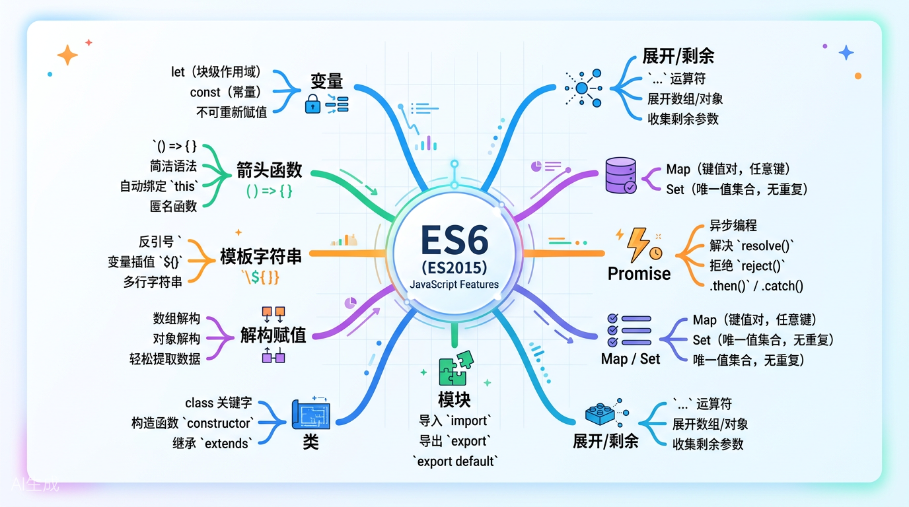
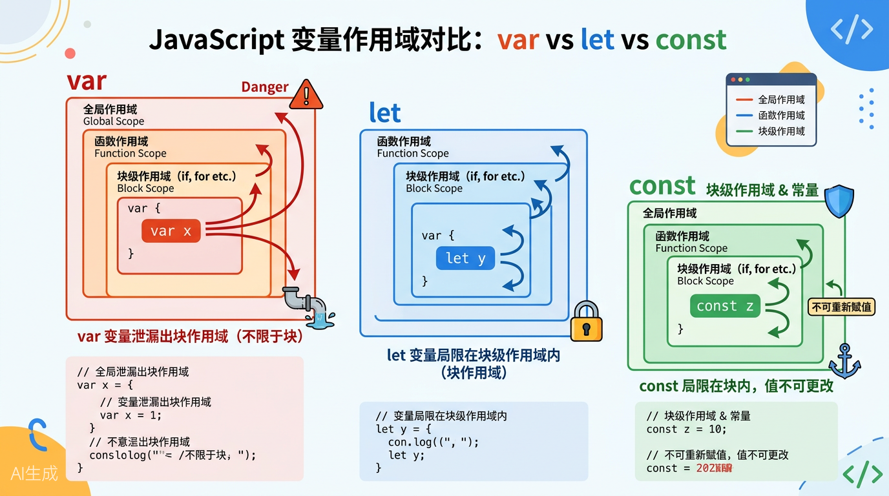

# 第一章：ES6概述与let/const变量声明

> **本章导读**：欢迎来到ES6的世界！在这一章中，我们将先了解ES6的前世今生，然后深入探讨JavaScript中最基础也最重要的改变——变量声明方式。从`var`到`let`和`const`，看似只是多了两个关键字，实则彻底改变了JavaScript的作用域规则。让我们开始这段学习旅程吧！



---

## 1.1 ES6简介——JavaScript的成人礼

### 什么是ES6？

想象一下，你有一款用了十年的手机，虽然能打电话发短信，但界面老旧、功能单一。突然有一天，厂家推出了全新升级版——更快的处理器、更好的相机、更流畅的系统。**ES6就是JavaScript的那次"全面升级"**。

**ES6**（全称 ECMAScript 2015）是JavaScript语言的一个重要版本，于**2015年6月**正式发布。它是自2009年ES5发布以来，JavaScript最大的一次更新，带来了数十项新特性和语法改进。

> **小贴士**：你可能听过ES6、ES2015、ECMAScript 2015这些名字，它们其实是同一个东西。TC39委员会（负责制定JavaScript标准的组织）决定从2015年开始每年发布一个新版本，所以ES6也叫ES2015，后面的版本依次是ES2016、ES2017……

### 为什么ES6如此重要？

在ES6之前，JavaScript虽然是一门灵活的语言，但也存在着诸多让人头疼的问题：

| 痛点 | 具体表现 |
|------|---------|
| 作用域混乱 | 只有函数作用域，没有块级作用域 |
| 变量提升 | 变量声明会自动提升到作用域顶部，容易出错 |
| 回调地狱 | 异步操作只能靠回调函数，代码层层嵌套 |
| 没有模块化 | 大型项目难以组织代码结构 |
| 语法冗长 | 实现简单功能也需要写很多模板代码 |

**ES6的出现就像给JavaScript这门语言装上了"现代引擎"**，让它从一门简单的脚本语言，蜕变为能够支撑大型应用开发的现代化编程语言。

### ES6的主要新特性概览

```javascript
// ES6带来的部分重要特性

// 1. let / const    —— 新的变量声明方式（本章重点）
// 2. 箭头函数       —— 更简洁的函数写法
// 3. 模板字符串     —— 告别字符串拼接
// 4. 解构赋值       —— 从对象/数组中提取数据的神器
// 5. 类（Class）    —— 面向对象编程的标准方式
// 6. 模块化         —— import / export
// 7. Promise        —— 优雅的异步处理
// 8. 默认参数       —— 函数参数的默认值
// 9. 展开运算符     —— ... 三个点的魔法
// 10. 迭代器和for...of —— 遍历的新方式
```

在接下来的教程中，我们将逐一学习这些特性。今天，让我们从最基础也是最重要的改变开始——**新的变量声明方式**。

---

## 1.2 var的问题——老玩家的三大"原罪"

在ES6之前，JavaScript中声明变量只有一个关键字：`var`。它就像一个"老古董"，虽然陪伴了JavaScript多年，但也有不少让人头疼的毛病。我们先来了解`var`的三大问题，这样才能理解为什么ES6要引入`let`和`const`。

### 问题一：变量提升（Hoisting）—— 神奇的"隔空取物"

**什么是变量提升？**

用`var`声明的变量，JavaScript会在背后偷偷把它们"提升"到所在作用域的最顶部。就像你还没宣布要请客，大家就已经知道你要买单了一样莫名其妙。

```javascript
// ========== ES5 var 的变量提升问题 ==========

// 先看这段代码，你觉得会输出什么？
console.log(name);  // 输出: undefined （不是报错！）
var name = "张三";
console.log(name);  // 输出: "张三"

// 实际上，JavaScript在幕后把代码变成了这样：
var name;           // 声明被提升到顶部（但赋值没有）
console.log(name);  // 此时name还没有赋值，所以是 undefined
name = "张三";       // 赋值留在这里
console.log(name);  // "张三"

// 这种"先使用后声明"的写法在var时代居然不报错！
// 很容易让开发者误以为变量已经初始化了

// ========== ES6 let 完美解决 ==========
console.log(age);   // 报错: ReferenceError: Cannot access 'age' before initialization
let age = 25;

// let不会提升变量到作用域顶部
// 在声明之前使用变量会直接报错，更加安全
```

> **坑点提醒**：变量提升只提升"声明"，不提升"赋值"。很多初学者以为`var`声明的变量会连值一起提升，这是一个常见误解。

### 问题二：重复声明—— 变量可以被"覆盖"无数次

```javascript
// ========== ES5 var 允许重复声明 ==========

var score = 80;
var score = 95;   // 完全不报错！前面的值被无情覆盖
console.log(score); // 输出: 95

// 在大型项目中，不同的开发者可能在同一个作用域中声明同名变量
// var不会报错，只会默默覆盖，导致难以发现的bug

// 更糟糕的是，在函数内部可能不小心覆盖了外部变量
var user = "外部用户";

function showUser() {
  var user = "内部用户";  // 这里的var其实是新声明了一个局部变量
  console.log(user);       // "内部用户"
}

showUser();
console.log(user);  // "外部用户" —— 还好这次没影响

// 但如果忘了写var呢？
function danger() {
  user = "危险！我修改了外部变量";  // 忘了var，变成了全局变量赋值！
}
danger();
console.log(user);  // "危险！我修改了外部变量" —— 外部变量被污染了！


// ========== ES6 let 不允许重复声明 ==========

let id = 100;
// let id = 200;   // 报错: SyntaxError: Identifier 'id' has already been declared

// 重复声明会在代码运行前就被发现，避免运行时出现莫名其妙的问题
```

### 问题三：没有块级作用域—— 大括号形同虚设

这是`var`最严重的问题。在ES5时代，JavaScript只有**全局作用域**和**函数作用域**，没有**块级作用域**。

```javascript
// ========== ES5 var 没有块级作用域 ==========

// 问题场景1：if语句中的变量"泄漏"出来
var flag = true;
if (flag) {
  var message = "我在if语句内部声明";
}
// 按常理，if语句结束后，message应该就"消失"了
console.log(message);  // 输出: "我在if语句内部声明"
// 居然能访问到！变量从if的"墙缝"里泄漏出来了！


// 问题场景2：for循环的计数器变量也"泄漏"了
for (var i = 0; i < 3; i++) {
  console.log("循环内:", i);  // 0, 1, 2
}
console.log("循环外:", i);     // 输出: 3
// i在for循环结束后依然存在！这完全不符合直觉！


// 问题场景3：经典面试题——循环中的异步操作
for (var j = 0; j < 3; j++) {
  setTimeout(function() {
    console.log("var版本:", j);  // 输出什么？
  }, 100);
}
// 结果输出三个 "var版本: 3"
// 因为循环结束后j已经变成了3，而setTimeout的回调共享同一个j


// ========== ES5时代的"曲线救国"：用IIFE（立即执行函数）解决 ==========

for (var k = 0; k < 3; k++) {
  (function(capturedK) {  // 通过函数参数"捕获"当前值
    setTimeout(function() {
      console.log("IIFE版本:", capturedK);  // 0, 1, 2 —— 终于正确了！
    }, 100);
  })(k);  // 立即执行，把当前的k值传进去
}

// 虽然能解决问题，但代码变得又丑又长，一层套一层


// ========== ES6 let 天然支持块级作用域 ==========

// if语句中的let变量不会泄漏
if (true) {
  let blockVar = "我被关在大括号里";
  console.log(blockVar);  // "我被关在大括号里"
}
// console.log(blockVar);   // 报错: ReferenceError: blockVar is not defined
// 完美！变量被锁在了大括号内部


// for循环中的let每次迭代都有新的绑定
for (let m = 0; m < 3; m++) {
  setTimeout(function() {
    console.log("let版本:", m);  // 0, 1, 2 —— 直接就是正确的！
  }, 100);
}
// let让每次循环都创建一个新的m变量，互不干扰
// 不需要IIFE，代码干净清爽
```

> **生活比喻**：你可以把块级作用域想象成**一堵围墙**。`var`就像能穿墙的幽灵，大括号根本拦不住它；而`let`和`const`就像有血有肉的普通人，大括号一围，就出不去也进不来了。

---



---

## 1.3 let详解——给变量加上"围栏"

### 什么是块级作用域？

**块级作用域（Block Scope）** 就是一对大括号`{ }`所包围的区域。在ES6中，`let`和`const`声明的变量只在大括号内部有效。

```javascript
// 块级作用域的常见"围墙"

// 围墙1：if语句
if (true) {
  let a = 1;
}
// console.log(a);  // 报错！在外面找不到a

// 围墙2：for/while循环
for (let i = 0; i < 5; i++) {
  let b = 2;
}
// console.log(b);  // 报错！
// console.log(i);  // 报错！

// 围墙3：普通的代码块（裸大括号）
{
  let c = 3;
  console.log(c);  // 3 —— 在墙内可以正常访问
}
// console.log(c);  // 报错！

// 围墙4：函数（函数本身就有作用域）
function demo() {
  let d = 4;
}
// console.log(d);  // 报错！

// 围墙5：switch语句
switch (true) {
  case true:
    let e = 5;
    break;
}
// console.log(e);  // 报错！
```

> **生活比喻**：想象一个小区，大括号`{ }`就是小区的围墙。`let`声明的变量就像住在小区里的居民——在小区内部他们可以自由活动，但出了围墙外面的人就不认识他们了。而`var`就像一个不受门禁约束的人，可以随意穿越任何围墙。

### 暂时性死区（Temporal Dead Zone，TDZ）

这是`let`的一个非常重要的特性，也是面试中的高频考点。

```javascript
// ========== 暂时性死区（TDZ） ==========

// 在let变量声明之前，存在一个"死区"，在此期间访问变量会报错

{
  // ====== 这里开始就是name变量的"暂时性死区" ======
  // console.log(name);  // 报错: ReferenceError: Cannot access 'name' before initialization
  
  // 在声明之前的整个区域都是"死区"
  // 即使外部有同名变量，这里也访问不到！
  
  let name = "ES6";   // 声明语句 —— 死区到此结束
  console.log(name);  // "ES6" —— 正常访问
}


// TDZ的"屏蔽"效果
var city = "北京";
{
  // console.log(city);  // 报错！不会访问到外部的"北京"
  let city = "上海";    // 内部的let声明创建了自己的作用域
  console.log(city);    // "上海"
}
console.log(city);      // "北京" —— 外部的变量完好无损


// var vs let 在TDZ上的对比
function compareTDZ() {
  // var版本：不报错，但值是undefined
  console.log(varVar);   // undefined（被提升了，但没有值）
  var varVar = "var变量";
  
  // let版本：直接报错
  // console.log(letVar);  // 如果取消注释，会报 ReferenceError
  let letVar = "let变量";
}
compareTDZ();
```

> **为什么叫"暂时性死区"？** 因为从代码块的开始到`let`声明语句之间，变量虽然"存在"（被登记了），但你无法访问它。就像一段路被暂时封死了，等到声明语句出现，路才重新开通。这个"封死"的区域就是暂时性死区。

### let的不允许重复声明

```javascript
// 在同一个作用域内，let不允许重复声明同名变量

let fruit = "苹果";
// let fruit = "香蕉";   // 报错: SyntaxError

// 但不同作用域可以（作用域链的遮蔽）
let animal = "猫";
{
  let animal = "狗";    // 没问题！这是另一个作用域中的animal
  console.log(animal);  // "狗"
}
console.log(animal);    // "猫"


// 即使是var + let 或 let + var 混合也不行！
var num = 10;
// let num = 20;  // 报错！同一个作用域内var和let不能重复声明
```

---

## 1.4 const详解——让变量"定死"

`const`是ES6引入的另一个变量声明关键字，专门用于声明**常量**（constant）。

### const的基本规则

```javascript
// ========== const的基本用法 ==========

// 规则1：const声明时必须立即初始化（赋值）
const PI = 3.14159;     // 正确！声明同时赋值
// const PI2;             // 报错！const声明后必须马上赋值

// 规则2：const声明后不能重新赋值
const MAX_SIZE = 100;
// MAX_SIZE = 200;        // 报错: TypeError: Assignment to constant variable

// 规则3：const也具有块级作用域
{
  const SECRET = "密码";
}
// console.log(SECRET);    // 报错: SECRET is not defined

// 规则4：const也有暂时性死区
{
  // console.log(API_KEY);  // 报错: Cannot access 'API_KEY' before initialization
  const API_KEY = "abc123";
}

// 规则5：const也不允许重复声明
const VERSION = "1.0.0";
// const VERSION = "2.0.0";  // 报错！
```

### const的"陷阱"：对象和数组

这是`const`最容易让人困惑的地方，也是面试中的经典考点。

```javascript
// ========== const与引用类型（对象/数组） ==========

// 关键概念：const保证的是"引用的不变"，不是"内容的不变"

const user = {
  name: "张三",
  age: 25
};

// 可以修改对象的属性！
user.age = 26;           // 没问题！
user.city = "北京";       // 甚至可以添加新属性！
console.log(user);       // { name: "张三", age: 26, city: "北京" }

// 但不能重新赋值整个对象
// user = { name: "李四" };  // 报错！不能改变引用


// 数组也一样
const colors = ["红", "绿", "蓝"];

colors.push("黄");       // 可以添加元素
colors[0] = "紫";        // 可以修改元素
console.log(colors);     // ["紫", "绿", "蓝", "黄"]

// colors = ["黑", "白"];  // 报错！不能重新赋值整个数组


// ========== 那如何让对象/数组完全不可变？ ==========

// 方法1：Object.freeze() —— 冻结对象（浅冻结）
const frozenUser = Object.freeze({
  name: "李四",
  info: { age: 30 }  // 嵌套的对象不会被冻结
});

// frozenUser.name = "王五";   // 严格模式下报错，非严格模式静默失败
// frozenUser.newProp = "x";   // 同样无效

// 注意：Object.freeze是浅冻结，嵌套对象仍然可修改
frozenUser.info.age = 31;     // 居然还能改！因为info对象本身没被冻结


// 方法2：使用 const + 好的编码习惯
// 如果你不想让别人修改你的对象，就不要提供修改的方法
// 或者使用 immer、Immutable.js 等不可变数据库


// ========== ES5时代的"常量"写法（对比） ==========

// 在ES5中，开发者用大写命名约定来"假装"常量
var ES5_PI = 3.14159;  // 全大写表示"不要修改我"，但其实随时可以改
ES5_PI = 3;             // 完全没问题，JavaScript不会阻止

// 或者用Object.defineProperty定义真正的常量
Object.defineProperty(window, 'REAL_PI', {
  value: 3.14159,
  writable: false    // 不可写
});
// REAL_PI = 3;  // 严格模式下报错，但写法太复杂了

// ES6的const让一切变得简单直接
const ES6_PI = 3.14159;  // 一行搞定，真正的常量！
```

> **生活比喻**：`const`就像一个**房子的门牌号**。门牌号是不能变的（你不能把"1号楼"改成"2号楼"），但房子里面的装修、家具是可以换的。如果你想让房子里面的东西也不能动，那就需要额外的"封条"（Object.freeze）。

### const在循环中的使用

```javascript
// const在for循环中的特殊表现

// for...of循环中可以用const
const arr = [10, 20, 30];
for (const item of arr) {
  console.log(item);  // 10, 20, 30 —— 每次迭代创建新的item绑定
  // item = 999;      // 如果在这里赋值会报错，但循环本身没问题
}

// for...in循环同理
for (const key in arr) {
  console.log(key);   // "0", "1", "2"
}

// 但传统的for循环不能用const
// for (const i = 0; i < 3; i++) {  // 报错！i++试图修改const变量
//   console.log(i);
// }
// 因为 i++ 相当于 i = i + 1，这在const上是不允许的
```

---

## 1.5 var / let / const 对比总结

| 特性 | var | let | const |
|------|-----|-----|-------|
| **作用域** | 函数作用域 | 块级作用域 | 块级作用域 |
| **变量提升** | 是（提升为undefined） | 否（存在TDZ） | 否（存在TDZ） |
| **重复声明** | 允许 | 不允许 | 不允许 |
| **初始化要求** | 不需要 | 不需要 | 必须立即初始化 |
| **重新赋值** | 可以 | 可以 | 不可以 |
| **声明全局变量** | 会成为window的属性 | 不会成为window的属性 | 不会成为window的属性 |
| **暂时性死区** | 无 | 有 | 有 |

```javascript
// 验证：全局作用域中的var会成为window的属性
var globalVar = "我是var";
let globalLet = "我是let";
const globalConst = "我是const";

console.log(window.globalVar);   // "我是var" —— 挂在了window上
console.log(window.globalLet);   // undefined —— 不会污染全局对象
console.log(window.globalConst); // undefined —— 也不会污染全局对象
```

---

## 1.6 最佳实践——从此告别var

### 黄金法则

现代JavaScript开发中，变量声明有一个简单而强大的最佳实践：

> **默认使用 `const`，需要修改时改用 `let`，永远不使用 `var`。**

### 为什么推荐这个规则？

```javascript
// ========== 最佳实践演示 ==========

// 场景1：一个值确定后不需要改变
const API_BASE_URL = "https://api.example.com";
const MAX_RETRY_COUNT = 3;
const USER_ROLE = "admin";

// 用const声明，代码意图明确："这些值是固定的"


// 场景2：一个值在运行时会改变
let currentPage = 1;        // 当前页码，会变化
let isLoading = false;      // 加载状态，会变化
let searchKeyword = "";     // 搜索关键词，会变化

// 用let声明，代码意图明确："这些值是动态的"


// 场景3：循环计数器
for (let i = 0; i < 10; i++) {
  // i在每次循环中被修改，所以用let
  console.log(i);
}


// 场景4：重新赋值的变量
let status = "pending";
status = "loading";
status = "completed";
// 状态会变化，用let
```

### 这个规则的好处

| 好处 | 说明 |
|------|------|
| **减少bug** | const防止意外修改，很多bug源于变量被不小心改掉 |
| **代码意图清晰** | 看到const就知道这个值不会被改，读代码更容易 |
| **便于重构** | 当你看到一个const，你可以放心地在多处引用它 |
| **配合工具** | ESLint等工具可以自动检测const是否被修改 |

```javascript
// 实战例子：一个购物车模块

const CART_KEY = "shopping_cart";     // 常量：localStorage的key
const TAX_RATE = 0.08;                 // 常量：税率

let cartItems = [];                    // 变量：购物车内容会变化
let totalPrice = 0;                    // 变量：总价会变化

function addToCart(product) {
  const newItem = {                    // newItem不会重新赋值，用const
    id: product.id,
    name: product.name,
    price: product.price,
    quantity: 1
  };
  
  cartItems.push(newItem);            // 修改数组内容，但不是重新赋值
  updateTotal();                      // 更新总价
}

function updateTotal() {
  // 用const接收reduce的结果（不会重新赋值）
  const subtotal = cartItems.reduce((sum, item) => {
    return sum + item.price * item.quantity;
  }, 0);
  
  // 这里需要重新赋值totalPrice，所以用let声明的totalPrice
  totalPrice = subtotal * (1 + TAX_RATE);
}
```

### 何时用var？

**答案：几乎从不。**

在一些需要兼容IE11的极老项目中，你可能还需要使用`var`。但在现代前端开发中（配合Babel转译），完全可以放心使用`let`和`const`。

```javascript
// 唯一可能需要var的场景：需要在全局作用域添加属性
// （但这通常不是好做法）
var deliberatelyGlobal = "我故意要成为全局变量";
// 等价于
window.deliberatelyGlobal = "我故意要成为全局变量";
```

---

## 1.7 本章小结与练习

### 核心知识点回顾

1. **ES6**是JavaScript自2015年以来的现代化版本，带来了大量语法改进
2. **`var`的三大问题**：变量提升、重复声明、没有块级作用域
3. **`let`的特点**：块级作用域、暂时性死区(TDZ)、不允许重复声明
4. **`const`的特点**：必须初始化、不能重新赋值、但对象的属性可以修改
5. **最佳实践**：默认用`const`，需要改再用`let`，不用`var`

### 自测练习题

**判断以下代码的输出结果（先思考，再看答案）：**

```javascript
// 练习题1
console.log(a);
var a = 1;

// 练习题2
{
  console.log(b);
  let b = 2;
}

// 练习题3
const obj = { x: 1 };
obj.x = 2;
obj.y = 3;
console.log(obj);

// 练习题4
for (var i = 0; i < 3; i++) {
  setTimeout(() => console.log("var:", i), 0);
}
for (let j = 0; j < 3; j++) {
  setTimeout(() => console.log("let:", j), 0);
}
```

<details>
<summary>点击查看答案</summary>

- **练习题1**：输出 `undefined`（var变量提升，声明提升但赋值不提升）
- **练习题2**：报错 `ReferenceError`（let存在暂时性死区）
- **练习题3**：输出 `{ x: 2, y: 3 }`（const对象的引用不能变，但属性可以修改）
- **练习题4**：输出 `var: 3` 三次，然后 `let: 0`、`let: 1`、`let: 2`（var共享同一个i，let每次迭代创建新的j）

</details>

---

> **下章预告**：在第二章中，我们将学习ES6中最受欢迎的特性之一——**箭头函数（Arrow Functions）**。它让函数写得更简洁，还解决了`this`指向的千古难题。敬请期待！

---

*本章完。如果读完后觉得有收获，建议收藏并跟着代码亲自敲一遍——编程是门手艺，光看可学不会哦！*
