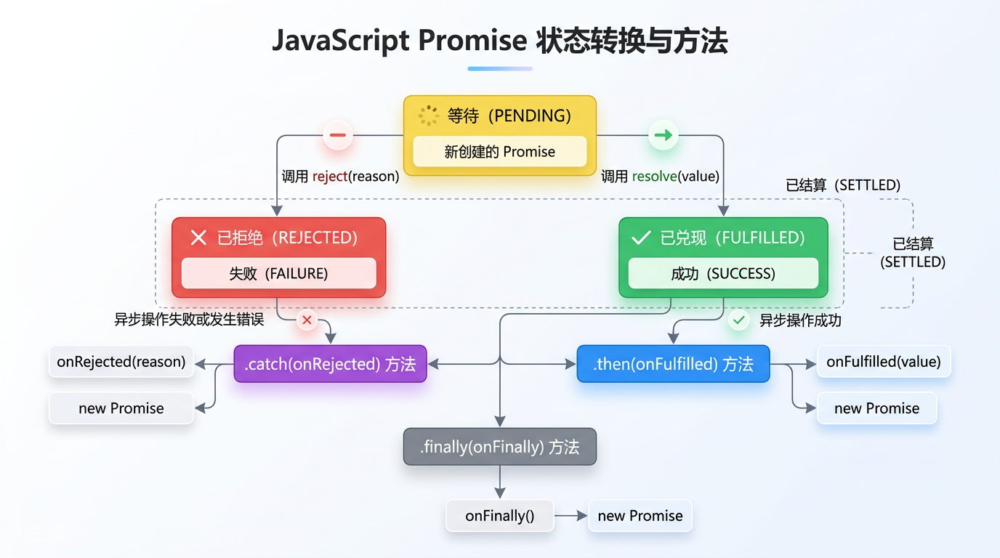

# 第五章：Promise与异步编程

> ** chapter quote **
> *"回调地狱曾让无数前端开发者夜不能寐，直到Promise像一盏明灯，照亮了异步编程的漫漫长路。"*

---

## 目录

1. [异步编程的痛：回调地狱（Callback Hell）](#51-异步编程的痛回调地狱callback-hell)
2. [Promise是什么：一个"外卖订单"的比喻](#52-promise是什么一个外卖订单的比喻)
3. [Promise的三种状态：pending、fulfilled、rejected](#53-promise的三种状态)
4. [Promise的基本用法：new Promise、resolve、reject](#54-promise的基本用法)
5. [then()与catch()：优雅的链式调用](#55-then与catch优雅的链式调用)
6. [finally()：无论如何都要做的事](#56-finally无论如何都要做的事)
7. [Promise.all()：人多力量大，并行执行](#57-promiseall人多力量大并行执行)
8. [Promise.race()：谁先完成用谁](#58-promiserace谁先完成用谁)
9. [Promise.allSettled()：一个都不能少](#59-promiseallsettled一个都不能少)
10. [async/await：让异步代码"看起来像同步"](#510-asyncawait让异步代码看起来像同步)
11. [本章小结](#511-本章小结)

---

## 5.1 异步编程的痛：回调地狱（Callback Hell）

### 5.1.1 什么是异步编程？

在讲Promise之前，我们先聊聊JavaScript里的**异步编程**。

JavaScript是单线程的语言——就像一个人只能同时做一件事。但生活中有很多"等待"的场景：煮水要等3分钟，外卖要等30分钟，网络请求要等服务器响应。如果在这干等着，别的啥也干不了，那就太浪费生命了！

所以JavaScript有了**异步**机制：发起一个耗时操作后，不傻等，继续干别的事，等操作完成后再回来处理结果。

```javascript
// 最简单的异步操作：定时器
console.log('开始煮水');

setTimeout(function() {
  console.log('水烧开了！');
}, 3000);

console.log('趁这3分钟，先去切个菜');

// 输出顺序：
// 开始煮水
// 趁这3分钟，先去切个菜
// （3秒后）水烧开了！
```

### 5.1.2 回调函数：异步的原始解决方案

在ES6之前，JavaScript处理异步主要靠**回调函数**（callback）——就是把一个函数当参数传进去，等异步操作完成后"回调"这个函数。

```javascript
// ES5 传统写法：用回调函数处理异步
function fetchData(callback) {
  setTimeout(function() {
    var data = { id: 1, name: '张三' };
    callback(data); // 异步操作完成，调用回调函数
  }, 1000);
}

// 使用回调
fetchData(function(result) {
  console.log('收到数据：', result);
});
```

听起来不错对吧？但问题是——**实际业务中，异步操作往往是环环相扣的**。

### 5.1.3 回调地狱：俄罗斯套娃式的噩梦

想象一下这个场景：你要先**登录** → 登录成功后**获取用户信息** → 获取到用户ID后**查询订单** → 查到订单后**获取订单详情** → 获取详情后**渲染页面**。

每一步都依赖上一步的结果，每一步都是异步操作。用回调函数来写，就是这样的：

```javascript
// ES5 传统写法：回调地狱（Callback Hell）
// 这代码就像一个倒过来的金字塔，越嵌套越深！

function login(username, password, callback) {
  setTimeout(function() {
    console.log('1. 登录成功，拿到token');
    callback({ token: 'abc123' });
  }, 1000);
}

function getUserInfo(token, callback) {
  setTimeout(function() {
    console.log('2. 获取用户信息，userId = 42');
    callback({ userId: 42, name: '张三' });
  }, 1000);
}

function getOrders(userId, callback) {
  setTimeout(function() {
    console.log('3. 获取订单列表');
    callback([{ orderId: 1001 }, { orderId: 1002 }]);
  }, 1000);
}

function getOrderDetail(orderId, callback) {
  setTimeout(function() {
    console.log('4. 获取订单 ' + orderId + ' 的详情');
    callback({ orderId: orderId, total: 299, items: ['商品A', '商品B'] });
  }, 1000);
}

// ========== 噩梦开始 ==========
// 这就像俄罗斯套娃，一层套一层，越来越深
login('zhangsan', '123456', function(loginResult) {
  getUserInfo(loginResult.token, function(userInfo) {
    getOrders(userInfo.userId, function(orders) {
      getOrderDetail(orders[0].orderId, function(detail) {
        // 终于拿到了！此时已经缩进到屏幕右边了...
        console.log('5. 最终订单详情：', detail);
        // 如果还要再加一步？继续往右缩进吧...
      });
    });
  });
});

// 输出：
// 1. 登录成功，拿到token
// 2. 获取用户信息，userId = 42
// 3. 获取订单列表
// 4. 获取订单 1001 的详情
// 5. 最终订单详情：{ orderId: 1001, total: 299, items: ['商品A', '商品B'] }
```

看看这代码的形状——**像一个横向的金字塔，不断向右缩进**。这就是大名鼎鼎的 **"回调地狱"（Callback Hell）** 或 **"末日金字塔"（Pyramid of Doom）**。

### 5.1.4 回调地狱的三大罪状

| 问题 | 说明 | 后果 |
|------|------|------|
| **代码嵌套过深** | 一层回调套一层，缩进越来越深 | 代码可读性极差，维护困难 |
| **错误处理混乱** | 每个回调都要单独处理错误 | 到处写`if (err)`，漏掉一个就崩 |
| **代码耦合严重** | 业务逻辑和异步控制混在一起 | 改一处可能牵动全身 |

```javascript
// ES5 错误处理的噩梦：每个回调都要处理错误
login('zhangsan', '123456', function(err, loginResult) {
  if (err) { console.error('登录失败:', err); return; }  // 第1个错误处理
  
  getUserInfo(loginResult.token, function(err, userInfo) {
    if (err) { console.error('获取用户信息失败:', err); return; }  // 第2个
    
    getOrders(userInfo.userId, function(err, orders) {
      if (err) { console.error('获取订单失败:', err); return; }  // 第3个
      
      getOrderDetail(orders[0].orderId, function(err, detail) {
        if (err) { console.error('获取详情失败:', err); return; }  // 第4个
        
        console.log('最终订单详情：', detail);
      });
    });
  });
});
```

这代码看着就让人血压飙升，对吧？

> **痛点总结**：回调函数虽然能处理异步，但面对多步骤串行异步操作时，代码会像俄罗斯套娃一样层层嵌套，最终变成难以维护的"意大利面条代码"。

**我们需要一种更好的方式——于是，Promise诞生了。**

---



---

## 5.2 Promise是什么：一个"外卖订单"的比喻

### 5.2.1 生活化比喻：点外卖

理解Promise最好的方式，就是想象你**点了一份外卖**：

1. **下单（创建Promise）**：你在APP上付了钱，店家承诺会给你做一份饭。此时你手里握着一张"订单凭证"——这就是Promise对象。
2. **等待中（pending状态）**：外卖正在制作/配送中，结果还不确定。可能送达，也可能洒了、丢了。
3. **送达（fulfilled状态）**：外卖小哥敲门，热腾腾的饭到手了！这就是"成功兑现承诺"。
4. **失败（rejected状态）**：外卖超时了，或者店家打电话说卖完了。这就是"承诺未能兑现"。

**Promise本质上就是一个"承诺的容器"**——它代表一个尚未完成但预期将来会完成的异步操作。你可以在这个容器上"注册回调"：成功时做什么、失败时做什么。

```
┌─────────────────────────────────────────────────────────────┐
│                    外卖订单（Promise）类比                     │
├─────────────────────────────────────────────────────────────┤
│                                                             │
│   你下单了！                                                │
│      │                                                      │
│      ▼                                                      │
│   ┌─────────────┐   配送中...    ┌─────────────┐           │
│   │  pending    │ ────────────►  │  fulfilled  │  ✅ 送达！  │
│   │  （等待中）  │                │  （已成功）  │             │
│   └─────────────┘                └─────────────┘           │
│          │                                                      │
│          │ 出错了...                                            │
│          ▼                                                      │
│   ┌─────────────┐                                                │
│   │  rejected   │  ❌ 失败！（超时/售罄/洒了）                   │
│   │  （已失败）  │                                                │
│   └─────────────┘                                                │
│                                                             │
└─────────────────────────────────────────────────────────────┘
```

### 5.2.2 Promise的技术定义

Promise是ES6引入的一个**内置对象**，用于表示一个异步操作的最终完成（或失败）及其结果值。

```javascript
// ES6 Promise：创建一个Promise
const order = new Promise(function(resolve, reject) {
  // 这里面放异步操作
  setTimeout(() => {
    const success = true; // 模拟外卖送达
    
    if (success) {
      resolve('您的黄焖鸡米饭已送达！'); // 成功，调用resolve
    } else {
      reject('很抱歉，外卖配送失败');     // 失败，调用reject
    }
  }, 2000);
});

// 处理结果
order
  .then(result => {
    console.log(result); // 您的黄焖鸡米饭已送达！
  })
  .catch(error => {
    console.error(error);
  });
```

---

## 5.3 Promise的三种状态

Promise对象有三种状态，就像外卖订单的生命周期：

| 状态 | 含义 | 类比 | 是否可变 |
|------|------|------|----------|
| **pending** | 进行中，尚未完成 | 外卖配送中 | — |
| **fulfilled** | 已成功完成 | 外卖已送达 | 一旦变 fulfilled，不可再变 |
| **rejected** | 已失败 | 外卖配送失败 | 一旦变 rejected，不可再变 |

```
                    ┌──────────────┐
                    │   pending    │
                    │  （等待中）   │
                    └──────┬───────┘
                           │
            ┌──────────────┼──────────────┐
            │              │              │
            ▼              │              ▼
     ┌─────────────┐       │      ┌─────────────┐
     │  fulfilled  │       │      │  rejected   │
     │  （已成功）  │       │      │  （已失败）  │
     └─────────────┘       │      └─────────────┘
                           │
                    【状态一旦确定，不可更改】
```

**重要特性：状态不可变**

Promise的状态一旦从pending变成fulfilled或rejected，就**再也不会改变**。就像外卖已经送到了，不可能再变回"配送中"。

```javascript
// 状态不可变的演示
const promise = new Promise((resolve, reject) => {
  resolve('第一次成功'); // 状态变为 fulfilled
  resolve('第二次成功'); // 这行不会生效！状态已经确定了
  reject('尝试失败');    // 这行也不会生效！
});

promise.then(result => {
  console.log(result); // 输出："第一次成功"，后面的都无效了
});
```

```javascript
// 三个状态值的获取
const p = new Promise((resolve, reject) => {
  // Promise 内部没有直接暴露 .status 属性给外部读取
  // 但我们可以通过 then/catch 来感知状态变化
});

// 实际上，开发者不需要直接读取状态
// 而是通过 then/catch/finally 来"响应"状态变化
```

---

## 5.4 Promise的基本用法

### 5.4.1 创建Promise：new Promise

创建Promise需要传入一个**执行器函数（executor）**，这个函数接收两个参数：`resolve`和`reject`。

```javascript
// ES6 写法：创建Promise的标准格式
const promise = new Promise((resolve, reject) => {
  // resolve: 异步操作成功时调用，将Promise状态变为fulfilled
  // reject:  异步操作失败时调用，将Promise状态变为rejected
  
  // 这里放你的异步操作（AJAX请求、定时器、文件读取等）
});
```

### 5.4.2 resolve 和 reject

```javascript
// ES6 完整示例：模拟AJAX请求
function fetchUserData(userId) {
  return new Promise((resolve, reject) => {
    console.log('开始请求用户数据...');
    
    setTimeout(() => {
      const mockDatabase = {
        1: { name: '张三', age: 25 },
        2: { name: '李四', age: 30 }
      };
      
      const user = mockDatabase[userId];
      
      if (user) {
        // ✅ 成功：调用resolve，传递结果数据
        resolve(user);
      } else {
        // ❌ 失败：调用reject，传递错误原因
        reject(new Error('用户不存在，ID: ' + userId));
      }
    }, 1000); // 模拟1秒网络延迟
  });
}

// 使用
fetchUserData(1)
  .then(user => {
    console.log('获取成功：', user);
    // 输出：获取成功：{ name: '张三', age: 25 }
  })
  .catch(err => {
    console.error('获取失败：', err.message);
  });

// 请求不存在的用户
fetchUserData(999)
  .then(user => {
    console.log('获取成功：', user);
  })
  .catch(err => {
    console.error('获取失败：', err.message);
    // 输出：获取失败：用户不存在，ID: 999
  });
```

### 5.4.3 ES5 vs ES6 写法对比：创建Promise

```javascript
// ============================================
// ES5 传统写法：基于回调函数的异步处理
// ============================================
function fetchDataES5(callback) {
  setTimeout(function() {
    var success = true;
    if (success) {
      callback(null, { data: '一些数据' }); // 第一个参数是错误，第二个是结果
    } else {
      callback(new Error('出错了'), null);
    }
  }, 1000);
}

// 使用：需要处理err参数
fetchDataES5(function(err, result) {
  if (err) {
    console.error('处理错误:', err);
  } else {
    console.log('处理结果:', result);
  }
});

// ============================================
// ES6 Promise 写法
// ============================================
function fetchDataES6() {
  return new Promise((resolve, reject) => {
    setTimeout(() => {
      const success = true;
      if (success) {
        resolve({ data: '一些数据' }); // 清晰！成功就resolve
      } else {
        reject(new Error('出错了'));   // 清晰！失败就reject
      }
    }, 1000);
  });
}

// 使用：通过then/catch分别处理成功和失败，逻辑更清晰
fetchDataES6()
  .then(result => console.log('处理结果:', result))
  .catch(err => console.error('处理错误:', err));
```

### 5.4.4 重要注意事项

```javascript
// ⚠️ 坑点1：Promise的executor是同步执行的！
console.log('A');

const p = new Promise((resolve, reject) => {
  console.log('B'); // 这行是同步执行的！
  resolve('C');
});

console.log('D');

// 输出顺序：A → B → D → C
// 解释：Promise构造器里的代码是同步的，then里的回调才是异步的

// ⚠️ 坑点2：忘记return Promise
function badFunction() {
  // 错误：没有return！调用者拿不到Promise
  new Promise((resolve) => {
    resolve('数据');
  });
}

function goodFunction() {
  // 正确：一定要return，才能链式调用
  return new Promise((resolve) => {
    resolve('数据');
  });
}

// ⚠️ 坑点3：resolve/reject只能传一个值
const p2 = new Promise((resolve) => {
  // 想传多个值？不行！后面的值会被忽略
  resolve('值1', '值2', '值3'); // 只保留了'值1'
});

p2.then(result => {
  console.log(result); // "值1"
});

// 解决方案：传一个对象
const p3 = new Promise((resolve) => {
  resolve({ name: '张三', age: 25, city: '北京' }); // ✅ 一个对象搞定
});
```

---

## 5.5 then()与catch()：优雅的链式调用

### 5.5.1 then()方法：处理成功

then()方法接收两个参数（都是可选的）：`onFulfilled`（成功回调）和`onRejected`（失败回调）。

```javascript
// then()的基本用法
promise.then(
  (result) => { /* 成功时执行 */ },
  (error) => { /* 失败时执行（可选） */ }
);
```

### 5.5.2 catch()方法：处理失败
catch()是`then(null, onRejected)`的语法糖，专门用来捕获错误，代码更清晰。

```javascript
// 这两种写法等价
promise.then(null, (err) => { /* 处理错误 */ });
promise.catch((err) => { /* 处理错误 */ }); // 推荐！更清晰
```

### 5.5.3 链式调用：Promise的杀手锏

**这是Promise最强大的特性！** 每个`then()`和`catch()`都返回一个新的Promise，所以可以继续`.then()`下去。

```javascript
// ============================================
// ES5：回调地狱（噩梦重现）
// ============================================
getData(function(a) {
  getMoreData(a, function(b) {
    getMoreData(b, function(c) {
      getMoreData(c, function(d) {
        console.log('最终结果：', d);
      });
    });
  });
});

// ============================================
// ES6：Promise链式调用（优雅！）
// ============================================
getData()
  .then(a => getMoreData(a))  // 返回新的Promise
  .then(b => getMoreData(b))  // 继续链式
  .then(c => getMoreData(c))  // 继续链式
  .then(d => {
    console.log('最终结果：', d);
  })
  .catch(err => {
    // 任何一个环节出错，都会跳到这里！
    console.error('某一步出错了：', err);
  });

// 看看这代码形状——一条直线，舒爽！
```

### 5.5.4 完整实战：用Promise链重构登录流程

```javascript
// ============================================
// ES5 回调地狱版：登录 → 获取用户信息 → 获取订单 → 获取详情
// ============================================
function loginES5(username, password, callback) {
  setTimeout(() => {
    if (username && password) {
      callback(null, { token: 'tk_' + Math.random().toString(36) });
    } else {
      callback(new Error('用户名或密码不能为空'));
    }
  }, 500);
}

function getUserInfoES5(token, callback) {
  setTimeout(() => {
    callback(null, { userId: 42, name: '张三', token: token });
  }, 500);
}

function getOrdersES5(userId, callback) {
  setTimeout(() => {
    callback(null, [{ orderId: 1001 }, { orderId: 1002 }]);
  }, 500);
}

function getOrderDetailES5(orderId, callback) {
  setTimeout(() => {
    callback(null, { orderId: orderId, items: ['iPhone', 'AirPods'], total: 9999 });
  }, 500);
}

// ES5 调用：金字塔地狱
loginES5('zhangsan', '123456', function(err, loginRes) {
  if (err) { console.error(err); return; }
  getUserInfoES5(loginRes.token, function(err, userInfo) {
    if (err) { console.error(err); return; }
    getOrdersES5(userInfo.userId, function(err, orders) {
      if (err) { console.error(err); return; }
      getOrderDetailES5(orders[0].orderId, function(err, detail) {
        if (err) { console.error(err); return; }
        console.log('ES5最终结果：', detail);
      });
    });
  });
});

// ============================================
// ES6 Promise版：同样的逻辑，完全不同的阅读体验
// ============================================
function loginES6(username, password) {
  return new Promise((resolve, reject) => {
    setTimeout(() => {
      if (username && password) {
        resolve({ token: 'tk_' + Math.random().toString(36) });
      } else {
        reject(new Error('用户名或密码不能为空'));
      }
    }, 500);
  });
}

function getUserInfoES6(token) {
  return new Promise((resolve) => {
    setTimeout(() => {
      resolve({ userId: 42, name: '张三', token: token });
    }, 500);
  });
}

function getOrdersES6(userId) {
  return new Promise((resolve) => {
    setTimeout(() => {
      resolve([{ orderId: 1001 }, { orderId: 1002 }]);
    }, 500);
  });
}

function getOrderDetailES6(orderId) {
  return new Promise((resolve) => {
    setTimeout(() => {
      resolve({ orderId: orderId, items: ['iPhone', 'AirPods'], total: 9999 });
    }, 500);
  });
}

// ES6 调用：一条直线，如丝般顺滑！
loginES6('zhangsan', '123456')
  .then(loginRes => getUserInfoES6(loginRes.token))
  .then(userInfo => getOrdersES6(userInfo.userId))
  .then(orders => getOrderDetailES6(orders[0].orderId))
  .then(detail => {
    console.log('ES6最终结果：', detail);
  })
  .catch(err => {
    // 任何一个环节出错，统一在这里捕获！
    console.error('流程出错了：', err.message);
  });
```

### 5.5.5 then()链的传值规则

```javascript
// then()链中值的传递规则

// 规则1：return 普通值 → 会被包装成 resolved 的 Promise
Promise.resolve(1)
  .then(val => {
    console.log(val);    // 1
    return val + 10;      // 返回 11（被自动包装成 Promise.resolve(11)）
  })
  .then(val => {
    console.log(val);    // 11
    return val * 2;       // 返回 22
  })
  .then(val => {
    console.log(val);    // 22
  });

// 规则2：return Promise → 会等待这个Promise完成
Promise.resolve('开始')
  .then(msg => {
    console.log(msg);   // "开始"
    // 返回一个新的Promise，链会等待它完成
    return new Promise(resolve => {
      setTimeout(() => resolve('异步操作完成'), 1000);
    });
  })
  .then(msg => {
    console.log(msg);   // 1秒后："异步操作完成"
  });

// 规则3：抛出错误 → 变成 rejected 的 Promise，跳到catch
then(val => {
  console.log(val);
  throw new Error('出错了！'); // 等同于 return Promise.reject(new Error('...'))
})
.then(val => {
  // 这行不会执行！
})
.catch(err => {
  console.error(err.message); // "出错了！"
});
```

### 5.5.6 对比总结

| 特性 | ES5 回调函数 | ES6 Promise |
|------|------------|-------------|
| 代码形状 | 金字塔嵌套 | 线性链式 |
| 错误处理 | 每个回调单独处理 | 一个catch全捕获 |
| 可读性 | 差，缩进越来越深 | 好，像同步代码 |
| 控制流 | 难以控制（并行/竞速） | 丰富的静态方法 |
| 调试 | 困难 | 相对容易 |

---

## 5.6 finally()：无论如何都要做的事

### 5.6.1 场景引入

想象你在页面里显示了一个"加载中..."的转圈动画。无论请求成功还是失败，你最后都要**关掉这个动画**。这就是`finally()`的用武之地。

```javascript
// finally()：不管成功还是失败，都会执行

function fetchData() {
  return new Promise((resolve, reject) => {
    setTimeout(() => {
      const random = Math.random();
      if (random > 0.5) {
        resolve('数据获取成功！');
      } else {
        reject(new Error('网络出错了'));
      }
    }, 1000);
  });
}

// 使用 finally
console.log('显示加载动画...');

fetchData()
  .then(data => {
    console.log('✅', data);
  })
  .catch(err => {
    console.error('❌', err.message);
  })
  .finally(() => {
    // 无论上面是then还是catch，这行都会执行
    console.log('隐藏加载动画...');
  });

// 可能的输出（成功时）：
// 显示加载动画...
// ✅ 数据获取成功！
// 隐藏加载动画...

// 可能的输出（失败时）：
// 显示加载动画...
// ❌ 网络出错了
// 隐藏加载动画...
```

### 5.6.2 ES5 vs ES6 对比

```javascript
// ============================================
// ES5：需要分别在成功和失败回调里写相同代码
// ============================================
var loading = true;
fetchDataES5(function(err, result) {
  loading = false; // 关掉动画
  if (err) {
    console.error('错误：', err);
  } else {
    console.log('结果：', result);
  }
  // 如果忘记在这写 loading = false，动画就永远转下去了...
});

// ============================================
// ES6：finally 一行搞定，不重复代码
// ============================================
let loading = true;
fetchData()
  .then(result => console.log('结果：', result))
  .catch(err => console.error('错误：', err))
  .finally(() => {
    loading = false; // 只写一次，保证执行
  });
```

> **注意**：`finally`的回调不接受任何参数，因为不知道前面是成功还是失败。它的作用就是执行"清理工作"。

```javascript
// ⚠️ finally 不接受参数
promise
  .finally(() => {
    // 正确：没有参数
    console.log('清理资源...');
  });
  // .finally((result) => { ... }) // 错误！没有参数
```

---

## 5.7 Promise.all()：人多力量大，并行执行

### 5.7.1 场景引入

假设你需要同时获取**用户信息、订单列表、优惠券**三个接口的数据，它们之间没有依赖关系，可以同时进行。你不需要等一个完成再请求下一个——可以**同时发三个请求，等全部完成后再一起处理**。

这就像你点了三份外卖，不需要一份一份等，可以同时等三份都到了再开饭！

### 5.7.2 Promise.all() 基本用法

```javascript
// Promise.all()：接收一个Promise数组，等所有Promise都成功后，返回结果数组

// 模拟三个独立的并行请求
function fetchUser() {
  return new Promise(resolve => {
    setTimeout(() => resolve({ name: '张三', id: 1 }), 1000);
  });
}

function fetchOrders() {
  return new Promise(resolve => {
    setTimeout(() => resolve([{ id: 101 }, { id: 102 }]), 1500);
  });
}

function fetchCoupons() {
  return new Promise(resolve => {
    setTimeout(() => resolve([{ id: 1, amount: 10 }]), 800);
  });
}

// ES6 Promise.all()：三个请求并行发起！
const startTime = Date.now();

Promise.all([
  fetchUser(),    // 第1个Promise
  fetchOrders(),  // 第2个Promise
  fetchCoupons()  // 第3个Promise
])
.then(([user, orders, coupons]) => {
  // 三个都完成后，结果按顺序放入数组
  const elapsed = Date.now() - startTime;
  console.log('总耗时约：' + elapsed + 'ms'); // 约1500ms（取最慢的那个）
  console.log('用户：', user);         // { name: '张三', id: 1 }
  console.log('订单：', orders);       // [{ id: 101 }, { id: 102 }]
  console.log('优惠券：', coupons);     // [{ id: 1, amount: 10 }]
})
.catch(err => {
  // 任何一个失败了，整体就失败
  console.error('至少一个请求失败了：', err);
});
```

### 5.7.3 ES5 vs ES6 对比：并行请求

```javascript
// ============================================
// ES5：并行请求 + 计数器（手写实现，容易出错）
// ============================================
function parallelRequestsES5(callbacks, finalCallback) {
  var results = [];
  var completed = 0;
  var hasError = false;
  
  callbacks.forEach(function(fn, index) {
    fn(function(err, result) {
      if (hasError) return; // 已经有错误，忽略后续结果
      if (err) {
        hasError = true;
        return finalCallback(err);
      }
      results[index] = result;
      completed++;
      if (completed === callbacks.length) {
        finalCallback(null, results);
      }
    });
  });
}

// 使用：需要自己管理计数器和顺序，很繁琐
// ============================================
// ES6：Promise.all() 一行搞定
// ============================================
Promise.all([fetchUser(), fetchOrders(), fetchCoupons()])
  .then(([user, orders, coupons]) => {
    // 结果自动按顺序排列，优雅！
  });
```

### 5.7.4 重要特性

```javascript
// ⚠️ 特性1：结果顺序与传入顺序一致，不是完成顺序
const p1 = new Promise(resolve => setTimeout(() => resolve('慢'), 2000));
const p2 = new Promise(resolve => setTimeout(() => resolve('快'), 100));

Promise.all([p1, p2]).then(([r1, r2]) => {
  console.log(r1, r2); // "慢" "快" —— 按传入顺序，不是完成顺序
});

// ⚠️ 特性2：一个失败，全部失败（"一损俱损"）
Promise.all([
  Promise.resolve('A'),
  Promise.reject('B出错了'), // 这个失败！
  Promise.resolve('C')
])
.then(results => {
  // 不会执行到这里
})
.catch(err => {
  console.log(err); // "B出错了" —— 只有第一个失败的原因
});
```

### 5.7.5 实际应用场景

```javascript
// 场景：页面初始化需要多个独立数据
async function initPage() {
  try {
    const [user, config, notifications] = await Promise.all([
      fetch('/api/user').then(r => r.json()),
      fetch('/api/config').then(r => r.json()),
      fetch('/api/notifications').then(r => r.json())
    ]);
    
    // 三个请求并行，总耗时 = 最慢的那个请求
    renderUser(user);
    applyConfig(config);
    showNotifications(notifications);
  } catch (err) {
    console.error('页面初始化失败:', err);
  }
}
```

---

## 5.8 Promise.race()：谁先完成用谁

### 5.8.1 场景引入

想象你同时在美团和饿了么上点了同一份外卖，**谁先送到就吃谁家的**。这就是`Promise.race()`的核心理念——多个Promise"赛跑"，只取最快完成的那个结果。

另一个常见场景是**请求超时控制**：给请求设置一个超时定时器，如果请求在超时前完成就用请求结果，否则报错。

### 5.8.2 Promise.race() 基本用法

```javascript
// Promise.race()：多个Promise竞争，只返回最快完成的那个

// 场景：给API请求加5秒超时
function fetchWithTimeout(url, timeout = 5000) {
  // 真实的fetch请求
  const fetchPromise = fetch(url);
  
  // 超时Promise
  const timeoutPromise = new Promise((_, reject) => {
    setTimeout(() => {
      reject(new Error('请求超时，超过 ' + timeout + 'ms'));
    }, timeout);
  });
  
  // 两者竞争！谁先完成用谁
  return Promise.race([fetchPromise, timeoutPromise]);
}

// 使用
fetchWithTimeout('/api/data', 3000)
  .then(response => response.json())
  .then(data => console.log('请求成功：', data))
  .catch(err => console.error('请求失败或超时：', err.message));
```

### 5.8.3 更多示例

```javascript
// 示例：两个数据源竞争，用最快的
const sourceA = new Promise(resolve => {
  setTimeout(() => resolve('来自CDN A'), Math.random() * 2000);
});

const sourceB = new Promise(resolve => {
  setTimeout(() => resolve('来自CDN B'), Math.random() * 2000);
});

Promise.race([sourceA, sourceB])
  .then(fastest => {
    console.log('最快的响应是：', fastest);
  });

// ⚠️ 注意：race返回最快完成的，不管它是成功还是失败
const winner = new Promise((_, reject) => {
  setTimeout(() => reject(new Error('我先失败了！')), 100); // 100ms后失败
});
const loser = new Promise(resolve => {
  setTimeout(() => resolve('我成功了，但太慢'), 2000); // 2秒后成功
});

Promise.race([winner, loser])
  .then(result => console.log(result))
  .catch(err => console.error(err.message)); // "我先失败了！"—— race只看"谁先完成"
```

### 5.8.4 ES5 vs ES6 对比

```javascript
// ============================================
// ES5：实现竞速逻辑（非常复杂）
// ============================================
function raceES5(tasks, callback) {
  var settled = false;
  tasks.forEach(function(fn) {
    fn(function(err, result) {
      if (!settled) {
        settled = true;
        callback(err, result);
      }
    });
  });
}

// ============================================
// ES6：Promise.race() 一行搞定
// ============================================
Promise.race([promise1, promise2, promise3])
  .then(winner => console.log('最快完成：', winner))
  .catch(err => console.error('最快完成的那个失败了：', err));
```

---

## 5.9 Promise.allSettled()：一个都不能少

### 5.9.1 场景引入

`Promise.all()`有个问题——只要其中一个失败，整体就失败，你拿不到其他成功请求的结果。但很多时候我们需要**知道每个Promise的最终状态，不管是成功还是失败**。

比如同时上传10张图片，即使其中2张失败，你也想知道另外8张的结果。

```javascript
// Promise.allSettled()：等所有Promise都"落定"（不管是成功还是失败）
// 返回每个Promise的状态和结果

const uploads = [
  Promise.resolve('图片1上传成功'),
  Promise.reject('图片2上传失败：文件太大'),
  Promise.resolve('图片3上传成功'),
  Promise.reject('图片4上传失败：网络断开')
];

Promise.allSettled(uploads)
  .then(results => {
    console.log(results);
    // [
    //   { status: 'fulfilled', value: '图片1上传成功' },
    //   { status: 'rejected',  reason: '图片2上传失败：文件太大' },
    //   { status: 'fulfilled', value: '图片3上传成功' },
    //   { status: 'rejected',  reason: '图片4上传失败：网络断开' }
    // ]
    
    // 可以分别统计成功和失败
    const successes = results.filter(r => r.status === 'fulfilled');
    const failures = results.filter(r => r.status === 'rejected');
    
    console.log(`✅ 成功 ${successes.length} 个`);
    console.log(`❌ 失败 ${failures.length} 个`);
    
    // 只展示成功的图片
    successes.forEach(s => console.log('展示：', s.value));
    
    // 给用户提示失败的
    failures.forEach(f => console.error('提示：', f.reason));
  });
```

### 5.9.2 三个静态方法对比

| 方法 | 返回时机 | 成功条件 | 失败条件 | 返回结果 |
|------|---------|---------|---------|---------|
| `Promise.all()` | 全部完成 | 所有都成功 | 任何一个失败 | 成功值数组 / 第一个失败原因 |
| `Promise.race()` | 最快的完成 | 最快的那个成功 | 最快的那个失败 | 最快完成的那个结果 |
| `Promise.allSettled()` | 全部落定 | —（永不reject） | 永不失败 | 包含所有Promise状态的对象数组 |

```javascript
// 快速对比
const promises = [
  Promise.resolve('A'),
  Promise.reject('B'),
  Promise.resolve('C')
];

// Promise.all: 整体失败
Promise.all(promises)
  .catch(err => console.log('all:', err)); // "B"

// Promise.allSettled: 返回所有状态
Promise.allSettled(promises)
  .then(results => console.log('allSettled:', results));
  // [{status:'fulfilled',value:'A'}, {status:'rejected',reason:'B'}, {status:'fulfilled',value:'C'}]
```

### 5.9.3 ES5 vs ES6 对比

```javascript
// ============================================
// ES5：手动实现 allSettled 逻辑
// ============================================
function allSettledES5(tasks, callback) {
  var results = new Array(tasks.length);
  var completed = 0;
  
  tasks.forEach(function(fn, index) {
    fn(function(err, result) {
      results[index] = err 
        ? { status: 'rejected', reason: err }
        : { status: 'fulfilled', value: result };
      completed++;
      if (completed === tasks.length) {
        callback(results); // 注意：ES5版本不会"失败"，总是"成功"
      }
    });
  });
}

// ============================================
// ES6：Promise.allSettled() 一行搞定
// ============================================
Promise.allSettled(promises)
  .then(results => {
    // results 包含所有Promise的最终状态
    results.forEach(r => {
      if (r.status === 'fulfilled') {
        console.log('成功：', r.value);
      } else {
        console.error('失败：', r.reason);
      }
    });
  });
```

> **注意**：`Promise.allSettled()` 是ES2020引入的，比ES6晚一些。它最大的特点是**永远不会reject**，总是resolve一个状态数组。

---

## 5.10 async/await：让异步代码"看起来像同步"

### 5.10.1 终极进化：从Promise到async/await

Promise已经很好了，但还有一个小问题：它本质上还是**回调**（只不过换了一种形式）。当你有一长串`.then().then().catch()`的时候，虽然比回调地狱好很多，但还是能感觉到"这是异步代码"。

**async/await**是ES2017（ES8）引入的语法糖，建立在Promise之上。它让异步代码**看起来和写起来都像同步代码**，这是JavaScript异步编程的终极解决方案。

> **核心思想**：用`async`标记一个函数是异步的，用`await"等待"一个Promise完成。就这么简单！**

### 5.10.2 基本语法

```javascript
// async/await 基本语法

// 1. async 关键字：声明一个异步函数
async function myFunction() {
  // 2. await 关键字：等待Promise完成，拿到结果
  const result = await somePromise;
  // 这里的代码会"暂停"，直到Promise完成，然后继续
  return result;
}

// async函数总是返回一个Promise
myFunction().then(result => {
  console.log(result);
});
```

### 5.10.3 用 async/await 重写登录流程

```javascript
// ============================================
// ES6 Promise版（前面已经写过）
// ============================================
function loginFlowPromise() {
  return loginES6('zhangsan', '123456')
    .then(loginRes => getUserInfoES6(loginRes.token))
    .then(userInfo => getOrdersES6(userInfo.userId))
    .then(orders => getOrderDetailES6(orders[0].orderId))
    .then(detail => {
      console.log('Promise结果：', detail);
      return detail;
    })
    .catch(err => {
      console.error('出错了：', err.message);
    });
}

// ============================================
// ES8 async/await版：看起来像同步代码！
// ============================================
async function loginFlowAsync() {
  try {
    // 看看这代码！像不像同步代码？
    const loginRes = await loginES6('zhangsan', '123456');
    const userInfo = await getUserInfoES6(loginRes.token);
    const orders = await getOrdersES6(userInfo.userId);
    const detail = await getOrderDetailES6(orders[0].orderId);
    
    console.log('async/await结果：', detail);
    return detail;
  } catch (err) {
    // 任何一个await出错，都会跳到catch！
    console.error('出错了：', err.message);
  }
}

// 调用async函数
loginFlowAsync();
```

看看对比！async/await版的代码：
- ✅ 没有`.then()`链
- ✅ 没有嵌套回调
- ✅ 用变量接收结果，像同步代码
- ✅ 用`try/catch`处理错误，像同步代码
- ✅ 代码从上到下阅读，符合直觉

### 5.10.4 async/await 的错误处理

```javascript
// 方式1：try/catch（推荐！像同步代码）
async function getData() {
  try {
    const user = await fetchUser();
    const orders = await fetchOrders(user.id);
    return orders;
  } catch (err) {
    // 任何一个await出错都会到这里
    console.error('请求失败：', err.message);
    // 可以重新抛出，或者返回默认值
    return []; // 返回空数组作为兜底
  }
}

// 方式2：catch特定Promise（更精细控制）
async function getData2() {
  const user = await fetchUser();
  
  // 只给这个await加错误处理
  const orders = await fetchOrders(user.id).catch(err => {
    console.log('获取订单失败，使用缓存数据');
    return getOrdersFromCache(); // 返回缓存数据兜底
  });
  
  return orders;
}

// 方式3：调用时catch
async function getData3() {
  const user = await fetchUser();
  const orders = await fetchOrders(user.id);
  return orders;
}
// 调用时处理
getData3().catch(err => console.error('外层捕获：', err));
```

### 5.10.5 async/await + Promise.all()：并行执行

```javascript
// async/await 和 Promise.all() 是绝配！

// 串行（慢）：一个等一个
async function sequential() {
  const user = await fetchUser();      // 1秒
  const orders = await fetchOrders();   // 1.5秒
  const coupons = await fetchCoupons(); // 0.8秒
  // 总耗时 = 1 + 1.5 + 0.8 = 3.3秒
  return { user, orders, coupons };
}

// 并行（快）：同时发起
async function parallel() {
  // 三个请求同时发出！
  const [user, orders, coupons] = await Promise.all([
    fetchUser(),
    fetchOrders(),
    fetchCoupons()
  ]);
  // 总耗时 = max(1, 1.5, 0.8) = 1.5秒
  return { user, orders, coupons };
}

// 混合模式：有依赖的先串行，独立的并行
async function mixed() {
  // 先登录（后续操作依赖token）
  const loginRes = await loginES6('user', 'pass');
  
  // token拿到后，下面三个可以并行
  const [userInfo, messages, settings] = await Promise.all([
    getUserInfoES6(loginRes.token),
    fetchMessages(),
    fetchSettings()
  ]);
  
  return { userInfo, messages, settings };
}
```

### 5.10.6 重要注意事项

```javascript
// ⚠️ 坑点1：await 只能在 async 函数内使用！
// 下面这行会报语法错误！
// const result = await fetchData(); // SyntaxError!

// 正确用法：包在async函数里
async function main() {
  const result = await fetchData(); // ✅
}

// 或者在顶层模块中（ES2022+支持顶层await）
// const result = await fetchData(); // 在ES模块顶层可以

// ⚠️ 坑点2：async函数总是返回Promise
async function getValue() {
  return 42; // 这里return的是普通值
}

const result = getValue();
console.log(result instanceof Promise); // true！被包装成了Promise

// 要拿到值，需要await或then
getValue().then(v => console.log(v)); // 42
// 或者在另一个async函数里
async function useValue() {
  const v = await getValue(); // v = 42
}

// ⚠️ 坑点3：forEach里不能用await！
async function wrongWay() {
  const ids = [1, 2, 3];
  // ❌ 错误：forEach不会等待每个await完成
  ids.forEach(async (id) => {
    const data = await fetchData(id); // 这些会同时执行，不是按顺序！
    console.log(data);
  });
  console.log('done'); // 这行会立即执行，不会等上面的await
}

async function rightWay() {
  const ids = [1, 2, 3];
  // ✅ 正确：用for...of循环
  for (const id of ids) {
    const data = await fetchData(id); // 按顺序，一个一个来
    console.log(data);
  }
  console.log('done'); // 等上面全部完成后才执行
  
  // 如果要并行，用Promise.all()
  const results = await Promise.all(ids.map(id => fetchData(id)));
}

// ⚠️ 坑点4：忘记await
async function forgotAwait() {
  const user = fetchUser(); // ❌ 忘记await！user是一个Promise对象，不是用户数据
  console.log(user.name);   // undefined！因为user是Promise
  
  const user2 = await fetchUser(); // ✅ 正确
  console.log(user2.name);         // "张三"
}
```

### 5.10.7 ES5 vs ES6 vs ES8 终极对比

```javascript
// ============================================
// 同样的业务逻辑：登录 → 获取用户信息 → 渲染页面
// ============================================

// ====== ES5：回调地狱 ======
login('user', 'pass', function(err, token) {
  if (err) { showError(err); return; }
  getUserInfo(token, function(err, user) {
    if (err) { showError(err); return; }
    renderPage(user, function(err) {
      if (err) { showError(err); return; }
      console.log('页面渲染完成');
    });
  });
});

// ====== ES6：Promise链 ======
login('user', 'pass')
  .then(token => getUserInfo(token))
  .then(user => renderPage(user))
  .then(() => console.log('页面渲染完成'))
  .catch(err => showError(err));

// ====== ES8：async/await ======
async function init() {
  try {
    const token = await login('user', 'pass');
    const user = await getUserInfo(token);
    await renderPage(user);
    console.log('页面渲染完成');
  } catch (err) {
    showError(err);
  }
}
init();
```

### 5.10.8 async/await 实际应用场景

```javascript
// 场景1：表单提交
async function handleSubmit(formData) {
  try {
    showLoading(true);
    
    // 先验证
    await validateForm(formData);
    
    // 再提交
    const result = await submitForm(formData);
    
    // 成功后跳转
    showSuccess('提交成功！');
    setTimeout(() => navigateTo('/success'), 1500);
    
  } catch (err) {
    showError(err.message);
  } finally {
    showLoading(false);
  }
}

// 场景2：分页加载
async function loadMore() {
  if (isLoading) return;
  isLoading = true;
  
  try {
    const data = await fetchList({ page: currentPage, size: 20 });
    appendToList(data.items);
    currentPage++;
    hasMore = data.hasMore;
  } catch (err) {
    console.error('加载失败：', err);
  } finally {
    isLoading = false;
  }
}

// 场景3：条件请求（依赖前面结果决定下一步）
async function smartFetch(userId) {
  const user = await fetchUser(userId);
  
  // 根据用户类型决定请求什么数据
  if (user.type === 'VIP') {
    const [orders, coupons, recommendations] = await Promise.all([
      fetchOrders(userId),
      fetchCoupons(userId),
      fetchRecommendations(userId)
    ]);
    return { user, orders, coupons, recommendations };
  } else {
    const orders = await fetchOrders(userId);
    return { user, orders };
  }
}
```

---

## 5.11 本章小结

### 知识图谱

```
第五章：Promise与异步编程
│
├─ 问题：回调地狱（Callback Hell）
│   └─ 嵌套深、错误处理乱、可读性差
│
├─ 解决方案1：Promise（ES6）
│   ├─ 三种状态：pending → fulfilled / rejected
│   ├─ new Promise((resolve, reject) => { ... })
│   ├─ .then() / .catch() / .finally()
│   ├─ 链式调用：解决回调地狱
│   └─ 静态方法：
│       ├─ Promise.all()     → 全部成功才算成功
│       ├─ Promise.race()    → 谁先完成用谁
│       └─ Promise.allSettled() → 等所有完成，永不失败
│
└─ 解决方案2：async/await（ES8）
    ├─ async 函数 = 自动返回Promise
    ├─ await = 等待Promise完成
    ├─ try/catch = 错误处理
    └─ 终极语法糖：异步代码看起来像同步
```

### 核心要点回顾

| 知识点 | 一句话总结 |
|--------|-----------|
| 回调地狱 | 回调嵌套像俄罗斯套娃，Promise把它拉直成一条线 |
| Promise状态 | pending → 一旦确定不可变 → fulfilled/rejected |
| then/catch | 链式调用是Promise的灵魂，让代码从金字塔变直线 |
| finally | 不管成功失败都要做的清理工作 |
| Promise.all | 并行执行，全部成功才算成功 |
| Promise.race | 多个竞争，谁快用谁 |
| Promise.allSettled | 等所有完成，一个不落 |
| async/await | 让异步代码看起来像同步，终极解决方案 |

### 最佳实践建议

```javascript
// ✅ 现代JS异步编程最佳实践：

// 1. 优先使用 async/await，代码最清晰
async function bestPractice() {
  try {
    const data = await fetchData();
    return process(data);
  } catch (err) {
    handleError(err);
  }
}

// 2. 需要并行时，async/await + Promise.all
async function parallelBestPractice() {
  const [users, orders] = await Promise.all([
    fetchUsers(),
    fetchOrders()
  ]);
}

// 3. 保留Promise对象的能力（有时你需要用.then）
function cacheableFetch(url) {
  // 返回Promise，让调用者自己决定用await还是.then
  return fetch(url).then(r => r.json());
}

// 4. 错误处理要到位
try {
  const result = await riskyOperation();
} catch (err) {
  // 不要静默吞掉错误！
  console.error('操作失败：', err);
  // 给用户反馈
  showToast('出错了，请稍后重试');
}
```

---

> **下一章预告**：第六章我们将学习 ES6 的另一个重磅特性——**Class与面向对象编程**。我们将用"工厂造汽车"的比喻，带你理解class、constructor、extends、super等概念，让你写出更优雅的面向对象代码！
