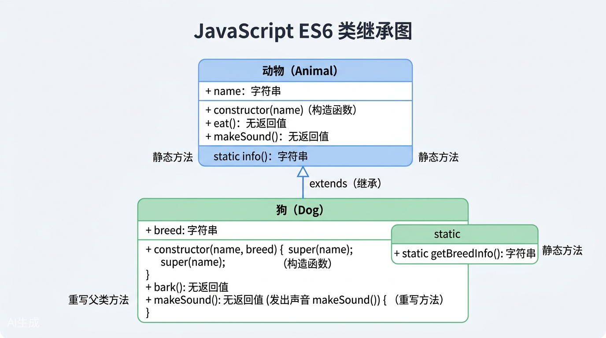
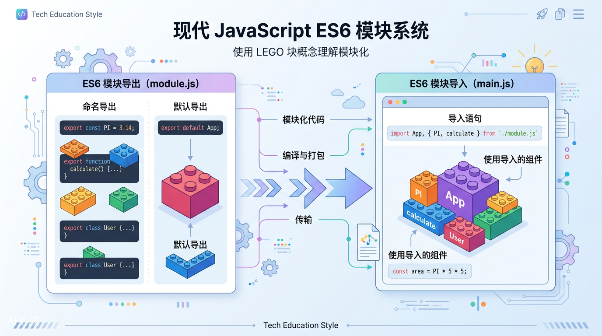

# 第六章：Class类与模块化

> **本章名言**："代码如家族，有传承也有分工；模块如积木，可独立也可拼接。"

---

## 6.1 从"女娲造人"到 Class 基本语法

### 6.1.1 为什么需要 Class？

在 ES5 时代，JavaScript 实现"面向对象"就像用泥巴捏人——通过**构造函数**和**原型链**来模拟类。虽然功能强大，但代码读起来总有点"拧巴"。

ES6 的 `class` 关键字，就像是给 JavaScript 配了一套**现代化的"造物说明书"**，让面向对象编程变得直观、优雅。

### 6.1.2 ES5 的"泥巴捏人"法

```javascript
// ==================== ES5 写法：构造函数 + 原型 ====================

// 构造函数（相当于"模具"）
function Person(name, age) {
  // 实例属性
  this.name = name;
  this.age = age;
}

// 方法定义在原型上（共享方法，节省内存）
Person.prototype.sayHello = function() {
  console.log('你好，我叫' + this.name + '，今年' + this.age + '岁');
};

Person.prototype.introduce = function() {
  console.log('我是' + this.name + '，一个热爱编程的人');
};

// 创建实例
var person1 = new Person('小明', 25);
person1.sayHello();  // 输出：你好，我叫小明，今年25岁

// typeof 检查：Person 本质上还是个函数
console.log(typeof Person);  // "function"
```

> **吐槽时间**：ES5 的写法虽然经典，但方法和属性分散在不同地方，新手经常搞不清该放 `this` 上还是放 `prototype` 上。

### 6.1.3 ES6 的"现代化造物说明书"

```javascript
// ==================== ES6 写法：Class 类 ====================

class Person {
  // 【constructor】构造函数：创建实例时自动调用
  // 相当于 ES5 中的 function Person(name, age)
  constructor(name, age) {
    // 实例属性
    this.name = name;
    this.age = age;
  }

  // 实例方法 —— 自动放在原型上，所有实例共享
  // 注意：方法之间不需要逗号！这是 Class 的语法规定
  sayHello() {
    console.log(`你好，我叫${this.name}，今年${this.age}岁`);
  }

  introduce() {
    console.log(`我是${this.name}，一个热爱编程的人`);
  }
}

// 创建实例（用法和 ES5 一样）
const person1 = new Person('小明', 25);
person1.sayHello();  // 输出：你好，我叫小明，今年25岁
person1.introduce(); // 输出：我是小明，一个热爱编程的人

// 验证方法在原型上
console.log(person1.__proto__ === Person.prototype);  // true
console.log(typeof Person);  // "function"（class 本质还是函数）
```

| 对比项 | ES5 构造函数 | ES6 Class |
|--------|-------------|-----------|
| 语法风格 | 分散定义（函数 + prototype） | 集中定义，大括号包裹 |
| 可读性 | 方法分散，不易一眼看清结构 | 像一个整体"蓝图" |
| 方法定义 | `Person.prototype.method = ...` | 直接写在 class 大括号内 |
| 方法间的分隔 | 无（每次独立赋值） | 不需要逗号分隔 |
| 本质 | 函数 | 函数的"语法糖" |

### 6.1.4 重要注意事项

```javascript
class Animal {
  constructor(name) {
    this.name = name;
  }

  // ⚠️ 坑点：方法之间加逗号会报错！
  // speak(),  ← 这样写会 SyntaxError！
  
  speak() {
    console.log(this.name + '发出声音');
  }
}

// Class 必须使用 new 调用
// Animal('小猫');  // TypeError: Class constructor Animal cannot be invoked without 'new'

const cat = new Animal('小猫');
cat.speak();  // "小猫发出声音"
```

> **坑点提醒**：
> 1. **Class 内方法之间不能加逗号**（和对象字面量不同！）
> 2. **Class 不能被普通函数调用**，必须用 `new`
> 3. **Class 不存在变量提升**，必须先定义后使用

```javascript
// ⚠️ 坑点：Class 不存在提升
const dog = new Dog('旺财');  // ReferenceError! 不能在声明前使用

class Dog {
  constructor(name) {
    this.name = name;
  }
}
```

---

## 6.2 实例属性和方法

### 6.2.1 什么是实例属性？

实例属性就是每个对象**自己独有**的数据。就像每个人都有自己的名字、年龄一样。

```javascript
// ==================== ES5 写法 ====================
function Car(brand, color) {
  // 实例属性 —— 每个实例都有自己的一份
  this.brand = brand;
  this.color = color;
  this.speed = 0;  // 默认速度为0
}

Car.prototype.accelerate = function(value) {
  this.speed += value;
  console.log(this.brand + '加速到' + this.speed + 'km/h');
};

Car.prototype.showInfo = function() {
  console.log('品牌：' + this.brand + '，颜色：' + this.color);
};

var car1 = new Car('宝马', '红色');
var car2 = new Car('奔驰', '黑色');

car1.accelerate(50);  // "宝马加速到50km/h"
car2.accelerate(80);  // "奔驰加速到80km/h"
// car1 和 car2 的 speed 互不干扰
```

```javascript
// ==================== ES6 写法 ====================
class Car {
  // 构造函数中定义实例属性
  constructor(brand, color) {
    this.brand = brand;   // 每个实例独立拥有
    this.color = color;
    this.speed = 0;       // 默认值
  }

  // 实例方法
  accelerate(value) {
    this.speed += value;
    console.log(`${this.brand}加速到${this.speed}km/h`);
  }

  showInfo() {
    console.log(`品牌：${this.brand}，颜色：${this.color}`);
  }
}

const car1 = new Car('宝马', '红色');
const car2 = new Car('奔驰', '黑色');

car1.accelerate(50);  // "宝马加速到50km/h"
car2.accelerate(80);  // "奔驰加速到80km/h"

// 验证：两个实例互不影响
console.log(car1.speed);  // 50
console.log(car2.speed);  // 80
```

### 6.2.2 类中的 getter 和 setter

```javascript
// ==================== ES5 写法：Object.defineProperty ====================
function Rectangle(width, height) {
  this._width = width;    // 下划线前缀表示"私有"（约定俗成）
  this._height = height;
}

Object.defineProperty(Rectangle.prototype, 'area', {
  get: function() {
    return this._width * this._height;
  }
});

Object.defineProperty(Rectangle.prototype, 'width', {
  get: function() {
    return this._width;
  },
  set: function(value) {
    if (value > 0) {
      this._width = value;
    }
  }
});
```

```javascript
// ==================== ES6 写法：get / set 关键字 ====================
class Rectangle {
  constructor(width, height) {
    this._width = width;   // "私有"属性（约定加下划线）
    this._height = height;
  }

  // 【getter】像属性一样访问，本质是方法
  // 用法：rect.area（不用加括号！）
  get area() {
    return this._width * this._height;
  }

  // 【getter】
  get width() {
    return this._width;
  }

  // 【setter】像属性一样赋值，可以添加校验逻辑
  // 用法：rect.width = 100
  set width(value) {
    if (value > 0) {
      this._width = value;
    } else {
      console.warn('宽度必须大于0！');
    }
  }

  get height() {
    return this._height;
  }

  set height(value) {
    if (value > 0) {
      this._height = value;
    }
  }
}

const rect = new Rectangle(5, 3);
console.log(rect.area);    // 15（像属性一样访问，不用括号）

rect.width = 10;           // 像属性一样赋值
console.log(rect.area);    // 30（自动重新计算）

rect.width = -5;           // "宽度必须大于0！"（setter 拦截无效值）
```

> **生活比喻**：Getter/Setter 就像自动售货机——投币（赋值）时它会检查真假币，出货（取值）时它会自动计算库存。

### 6.2.3 新特性：类字段（Class Fields）

```javascript
// ==================== ES6+ 新语法：类字段（ES2022正式标准化）=================

class User {
  // 【类字段】直接在类中声明属性，不需要在 constructor 里写 this.xxx
  // 这样写更直观，每个实例都有一份
  name = '匿名';
  age = 0;
  
  // 甚至可以这样写：
  hobbies = [];  // 每个实例有自己独立的数组！

  constructor(name, age) {
    // 如果有传入参数，覆盖默认值
    if (name) this.name = name;
    if (age) this.age = age;
  }

  addHobby(hobby) {
    this.hobbies.push(hobby);
  }

  showHobbies() {
    console.log(`${this.name}的爱好：${this.hobbies.join('、')}`);
  }
}

const user1 = new User('小红', 20);
const user2 = new User('小刚', 22);

user1.addHobby('画画');
user1.addHobby('唱歌');
user2.addHobby('打篮球');

user1.showHobbies();  // "小红的爱好：画画、唱歌"
user2.showHobbies();  // "小刚的爱好：打篮球"
// 两人的 hobbies 互不影响！
```

> ⚠️ **注意**：类字段语法虽然好用，但需要确保你的构建工具（Babel）或运行环境支持。现代浏览器和 Node.js 14+ 已原生支持。

---



---

## 6.3 继承 extends：家族的传承

### 6.3.1 什么是继承？

想象一个家族：**爷爷 → 爸爸 → 儿子**。儿子继承了爸爸的眼睛颜色，爸爸继承了爷爷的幽默感。但每一代人又有自己的特色。

代码中的继承也是如此：**子类继承父类的属性和方法，同时可以添加自己的特色**。

### 6.3.2 ES5 的继承：手动拼接"家族树"

```javascript
// ==================== ES5 写法：原型链继承 ====================

// 父类：Animal（动物）
function Animal(name) {
  this.name = name;
  this.type = '动物';  // 所有动物的共同属性
}

Animal.prototype.speak = function() {
  console.log(this.name + '发出一些声音');
};

Animal.prototype.introduce = function() {
  console.log('我是' + this.name + '，一只' + this.type);
};

// 子类：Dog（狗）—— 需要手动设置继承关系
function Dog(name, breed) {
  // 【关键】调用父类构造函数，继承父类的实例属性
  Animal.call(this, name);  // 相当于：this.name = name;
  
  this.breed = breed;       // 子类自己的属性
  this.type = '狗';
}

// 【关键】建立原型链继承
// Object.create 创建一个新对象，其原型指向 Animal.prototype
Dog.prototype = Object.create(Animal.prototype);

// 【关键】修正 constructor 指向
Dog.prototype.constructor = Dog;

// 子类自己的方法
Dog.prototype.speak = function() {
  // 可以调用父类的方法
  Animal.prototype.speak.call(this);
  console.log(this.name + '：汪汪汪！');
};

Dog.prototype.fetch = function() {
  console.log(this.name + '去捡球了');
};

var dog = new Dog('旺财', '金毛');
dog.introduce();  // "我是旺财，一只狗"（继承自 Animal）
dog.speak();      // "旺财发出一些声音" "旺财：汪汪汪！"
dog.fetch();      // "旺财去捡球了"（Dog 自己的方法）

console.log(dog instanceof Dog);     // true
dog instanceof Animal;  // true
```

> **ES5 的痛苦**：
> 1. 要用 `Animal.call(this, ...)` 调用父构造函数
> 2. 要用 `Object.create()` 建立原型链
> 3. 要手动修正 `constructor` 指向
> 4. 调用父类方法要写长长的 `Animal.prototype.method.call(this)`

### 6.3.3 ES6 的继承：一句 extends 搞定

```javascript
// ==================== ES6 写法：extends 关键字 ====================

// 父类：Animal（动物）
class Animal {
  constructor(name) {
    this.name = name;
    this.type = '动物';
  }

  speak() {
    console.log(`${this.name}发出一些声音`);
  }

  introduce() {
    console.log(`我是${this.name}，一只${this.type}`);
  }
}

// 子类：Dog（狗）—— 用 extends 一句话声明继承关系
// extends 就像说："Dog 是 Animal 的孩子"
class Dog extends Animal {
  constructor(name, breed) {
    // 【super】调用父类的 constructor
    // 相当于 ES5 的 Animal.call(this, name)
    super(name);  // ⚠️ 必须放在 constructor 的第一行！
    
    this.breed = breed;  // 子类自己的属性
    this.type = '狗';
  }

  // 【重写】覆盖父类的 speak 方法
  speak() {
    // super.speak() 调用父类的 speak 方法
    super.speak();
    console.log(`${this.name}：汪汪汪！`);
  }

  // 【新增】子类自己的方法
  fetch() {
    console.log(`${this.name}去捡球了`);
  }
}

const dog = new Dog('旺财', '金毛');
dog.introduce();  // "我是旺财，一只狗"（继承自 Animal）
dog.speak();      // "旺财发出一些声音" "旺财：汪汪汪！"
dog.fetch();      // "旺财去捡球了"（Dog 自己的方法）

// 验证继承关系
console.log(dog instanceof Dog);     // true
dog instanceof Animal;  // true（Dog 也是 Animal 的实例）
```

| 步骤 | ES5 写法 | ES6 写法 |
|------|---------|---------|
| 声明继承 | 手动设置原型链 | `class Dog extends Animal` |
| 调用父构造函数 | `Animal.call(this, name)` | `super(name)` |
| 调用父类方法 | `Animal.prototype.method.call(this)` | `super.method()` |
| 修正 constructor | `Dog.prototype.constructor = Dog` | 自动处理 |
| 可读性 | 代码分散，难理解 | 一目了然 |

### 6.3.4 更复杂的继承链

```javascript
// 家族三代：Animal → Dog → GuideDog（导盲犬）

class Animal {
  constructor(name) {
    this.name = name;
  }

  eat() {
    console.log(`${this.name}在吃东西`);
  }
}

class Dog extends Animal {
  constructor(name, breed) {
    super(name);
    this.breed = breed;
  }

  bark() {
    console.log(`${this.name}：汪汪！`);
  }
}

// GuideDog 继承自 Dog，间接继承 Animal
class GuideDog extends Dog {
  constructor(name, breed, owner) {
    super(name, breed);    // 调用 Dog 的 constructor
    this.owner = owner;    // 导盲犬特有的属性
  }

  // 重写 bark 方法
  bark() {
    console.log(`${this.name}轻声叫了一声（不打扰主人）`);
  }

  // 导盲犬特有的方法
  guide() {
    console.log(`${this.name}正在引导${this.owner}过马路`);
  }
}

const guideDog = new GuideDog('Lucky', '拉布拉多', '张叔叔');
guideDog.eat();    // "Lucky在吃东西"（继承自 Animal）
guideDog.bark();   // "Lucky轻声叫了一声（不打扰主人）"（重写自 Dog）
guideDog.guide();  // "Lucky正在引导张叔叔过马路"（自己的方法）

// 原型链验证
console.log(guideDog instanceof GuideDog);  // true
console.log(guideDog instanceof Dog);       // true
console.log(guideDog instanceof Animal);    // true
```

> **家族比喻**：`GuideDog` 是儿子，`Dog` 是爸爸，`Animal` 是爷爷。儿子继承了爷爷的基因（`eat`），改写了爸爸的行为（`bark`），还有自己独特的技能（`guide`）。

---

## 6.4 super 关键字：连接代际的桥梁

### 6.4.1 super 的两种用法

`super` 就像家族中的"传家宝"——它有两种使用方式：

1. **`super()`** —— 调用父类的构造函数（只能在子类 constructor 中使用）
2. **`super.method()`** —— 调用父类的方法

```javascript
// ==================== ES5：调用父类方法很啰嗦 ====================

function Bird(name) {
  Animal.call(this, name);
  this.type = '鸟';
}
Bird.prototype = Object.create(Animal.prototype);
Bird.prototype.constructor = Bird;

Bird.prototype.speak = function() {
  // 调用父类方法要写这么长一串！
  Animal.prototype.speak.call(this);
  console.log(this.name + '：叽叽喳喳！');
};
```

```javascript
// ==================== ES6：super 简洁优雅 ====================

class Bird extends Animal {
  constructor(name) {
    super(name);        // super() = 调用父类的 constructor
    this.type = '鸟';
  }

  speak() {
    super.speak();      // super.speak() = 调用父类的 speak 方法
    console.log(`${this.name}：叽叽喳喳！`);
  }

  // 父类没有的全新方法
  fly() {
    console.log(`${this.name}展翅高飞！`);
  }
}

const bird = new Bird('小黄');
bird.speak();  // "小黄发出一些声音"  "小黄：叽叽喳喳！"
bird.fly();    // "小黄展翅高飞！"
```

### 6.4.2 super 的坑点

```javascript
class Parent {
  constructor(value) {
    this.value = value;
  }
}

class Child extends Parent {
  constructor(value, extra) {
    // ⚠️ 坑点 1：在调用 super() 之前，不能使用 this！
    // console.log(this);  // ReferenceError!
    
    super(value);  // 必须先调用 super()！
    
    // super() 之后才能使用 this
    this.extra = extra;
  }
}

const child = new Child(100, 200);
console.log(child);  // { value: 100, extra: 200 }
```

> **坑点总结**：
> | 坑点 | 说明 |
> |------|------|
> | 必须第一行调用 | `super()` 必须在 constructor 中第一行调用（严格来说是在使用 `this` 之前） |
> | 不写 super 报错 | 子类 constructor 中如果不写 `super()`，使用 `this` 会报错 |
> | 不传参会 undefined | `super()` 中的参数如果不传，父类收到的就是 `undefined` |
> | 只能在子类中用 | `super` 只能在子类（extends）的 constructor 或方法中使用 |

### 6.4.3 不写 constructor 会怎样？

```javascript
class Cat extends Animal {
  // 如果不写 constructor，JavaScript 会自动生成：
  // constructor(...args) {
  //   super(...args);
  // }
  
  // 所以直接写方法就好了！
  speak() {
    super.speak();
    console.log(`${this.name}：喵喵喵~`);
  }
}

const cat = new Cat('咪咪');
cat.speak();     // "咪咪发出一些声音"  "咪咪：喵喵喵~"
cat.introduce(); // "我是咪咪，一只动物"（继承自 Animal）
```

> **小贴士**：如果子类不需要额外的属性，完全可以不写 `constructor`，JavaScript 会自动帮你调用父类的构造函数。

---

## 6.5 静态方法 static：类级别的方法

### 6.5.1 什么是静态方法？

想象一个**全校广播系统**——它不是某个学生在说话，而是**学校本身**在发通知。静态方法就是属于**类本身**的方法，而不是实例的方法。

```javascript
// ==================== ES5 写法：直接给函数添加属性 ====================

function MathUtils() {
  // 不需要创建实例，所以构造函数通常空着
}

// "静态方法"——直接挂在构造函数上
MathUtils.add = function(a, b) {
  return a + b;
};

MathUtils.multiply = function(a, b) {
  return a * b;
};

MathUtils.PI = 3.14159;  // "静态属性"

// 直接通过类名调用，不需要 new
console.log(MathUtils.add(2, 3));       // 5
console.log(MathUtils.multiply(4, 5));  // 20
console.log(MathUtils.PI);              // 3.14159

// new 出来不能用静态方法
var utils = new MathUtils();
// utils.add(1, 2);  // TypeError: utils.add is not a function
```

```javascript
// ==================== ES6 写法：static 关键字 ====================

class MathUtils {
  // 静态属性（ES2022+ 支持，或写在类外面）
  static PI = 3.14159;

  // 【static】静态方法 —— 属于类本身，不属于实例
  // 调用方式：MathUtils.add(2, 3)（不需要 new）
  static add(a, b) {
    return a + b;
  }

  static multiply(a, b) {
    return a * b;
  }

  // 静态方法可以调用其他静态方法
  static square(a) {
    // 静态方法中 this 指向类本身
    return this.multiply(a, a);  // 等价于 MathUtils.multiply(a, a)
  }

  // 实例方法
  showMessage() {
    console.log('我是一个工具实例（虽然没什么用）');
  }
}

// 直接通过类名调用静态方法（不需要 new！）
console.log(MathUtils.add(2, 3));       // 5
console.log(MathUtils.multiply(4, 5));  // 20
console.log(MathUtils.square(5));       // 25
console.log(MathUtils.PI);              // 3.14159

// 实例调用实例方法
const utils = new MathUtils();
utils.showMessage();  // "我是一个工具实例（虽然没什么用）"

// ⚠️ 实例不能调用静态方法
// utils.add(1, 2);  // TypeError: utils.add is not a function

// ⚠️ 静态方法中不能访问实例属性（因为没有实例）
// 但实例方法可以访问静态属性
```

### 6.5.2 实际应用：工具类与工厂方法

```javascript
// ==================== 实用场景：日期格式化工具类 ====================

class DateFormatter {
  // 静态属性：预定义的格式模板
  static FORMATS = {
    YMD: 'YYYY-MM-DD',
    YMDHMS: 'YYYY-MM-DD HH:mm:ss',
    HMS: 'HH:mm:ss'
  };

  // 静态方法：格式化日期
  static format(date, pattern = 'YYYY-MM-DD') {
    const d = new Date(date);
    const year = d.getFullYear();
    const month = String(d.getMonth() + 1).padStart(2, '0');
    const day = String(d.getDate()).padStart(2, '0');
    const hours = String(d.getHours()).padStart(2, '0');
    const minutes = String(d.getMinutes()).padStart(2, '0');
    const seconds = String(d.getSeconds()).padStart(2, '0');

    return pattern
      .replace('YYYY', year)
      .replace('MM', month)
      .replace('DD', day)
      .replace('HH', hours)
      .replace('mm', minutes)
      .replace('ss', seconds);
  }

  // 静态方法：获取当前时间字符串
  static now(pattern = 'YYYY-MM-DD HH:mm:ss') {
    return this.format(new Date(), pattern);
  }

  // 静态方法：判断是否为闰年
  static isLeapYear(year) {
    return (year % 4 === 0 && year % 100 !== 0) || (year % 400 === 0);
  }
}

// 使用：不需要创建实例，直接调用
console.log(DateFormatter.now());                          // "2024-01-15 10:30:00"
console.log(DateFormatter.format('2024-06-01', 'YYYY年MM月DD日'));  // "2024年06月01日"
console.log(DateFormatter.isLeapYear(2024));               // true
console.log(DateFormatter.FORMATS.YMDHMS);                 // "YYYY-MM-DD HH:mm:ss"
```

### 5.5.3 静态方法的继承

```javascript
class BaseController {
  static logRequest(url) {
    console.log(`[${this.now()}] 请求：${url}`);
  }

  static now() {
    return new Date().toLocaleString();
  }
}

class UserController extends BaseController {
  // 静态方法也会继承！
  // UserController.logRequest() 可以直接用
}

class OrderController extends BaseController {
  // 可以重写静态方法
  static now() {
    return new Date().toISOString();  // 改用 ISO 格式
  }
}

UserController.logRequest('/api/users');   // "[2024/1/15 10:30:00] 请求：/api/users"
OrderController.logRequest('/api/orders'); // "[2024-01-15T02:30:00.000Z] 请求：/api/orders"
```

---



---

## 6.6 模块化 export：打造乐高积木

### 6.6.1 为什么需要模块化？

想象你正在拼乐高——所有零件混在一个大袋子里，找一个小零件要翻半天。模块化就是把零件**分类装在小盒子里**，用的时候拿对应的盒子。

在 JavaScript 中，模块化让我们可以：
- ✅ 将代码拆分成独立的文件
- ✅ 明确声明"我要导出什么"（export）
- ✅ 精确控制"我要引入什么"（import）
- ✅ 避免全局变量污染
- ✅ 实现代码复用

### 6.6.2 命名导出（Named Export）

```javascript
// ==================== math.js ====================
// 命名导出：导出多个内容，每个都有自己的名字

// 方式一：导出时加 export 关键字
export const PI = 3.14159;

export function add(a, b) {
  return a + b;
}

export function subtract(a, b) {
  return a - b;
}

// 方式二：先定义，再统一导出（放在文件末尾）
function multiply(a, b) {
  return a * b;
}

function divide(a, b) {
  if (b === 0) throw new Error('不能除以0！');
  return a / b;
}

class Calculator {
  constructor() {
    this.history = [];
  }
  
  calculate(operation, a, b) {
    let result;
    switch(operation) {
      case 'add': result = add(a, b); break;
      case 'subtract': result = subtract(a, b); break;
      case 'multiply': result = multiply(a, b); break;
      case 'divide': result = divide(a, b); break;
    }
    this.history.push({ operation, a, b, result });
    return result;
  }
}

// 统一导出（可以重命名）
export { multiply, divide, Calculator };
// export { multiply as mul, divide as div };  // 也可以重命名导出
```

### 6.6.3 默认导出（Default Export）

```javascript
// ==================== axios.js（简化版示例）=================
// 默认导出：一个文件只有一个"默认"导出
// 适合导出主要功能，配合命名导出辅助功能

// 方式一：直接导出函数
export default function request(config) {
  console.log(`发起请求：${config.url}`);
  return fetch(config.url, config);
}

// 同一个文件中，默认导出和命名导出可以共存
export const BASE_URL = 'https://api.example.com';
export const TIMEOUT = 5000;

export function setDefaultHeaders(headers) {
  console.log('设置默认请求头：', headers);
}
```

```javascript
// ==================== User.js（Class 的默认导出）=================
// 默认导出一个 Class

export default class User {
  constructor(name, email) {
    this.name = name;
    this.email = email;
    this.createdAt = new Date();
  }

  sayHi() {
    console.log(`你好，我是${this.name}`);
  }

  getInfo() {
    return {
      name: this.name,
      email: this.email,
      createdAt: this.createdAt
    };
  }
}

// 同时命名导出一些辅助函数
export function validateEmail(email) {
  return /^[^\s@]+@[^\s@]+\.[^\s@]+$/.test(email);
}

export function generateId() {
  return Date.now().toString(36) + Math.random().toString(36).substr(2);
}
```

| 导出方式 | 语法 | 一个文件有几个 | 使用场景 |
|---------|------|-------------|---------|
| 命名导出 | `export { name }` 或 `export const name` | 多个 | 工具函数、常量、辅助方法 |
| 默认导出 | `export default name` | 只能一个 | 模块的主要功能/类 |

### 6.6.4 ES5 时代的模块方案（回顾）

```javascript
// ==================== ES5：立即执行函数（IIFE）模拟模块 ====================

// mathModule.js
var mathModule = (function() {
  // 私有变量（外部无法访问）
  var PI = 3.14159;
  var version = '1.0.0';

  // 私有函数
  function helper() {
    console.log('我是私有辅助函数');
  }

  // 公开的 API
  return {
    PI: PI,
    add: function(a, b) {
      return a + b;
    },
    subtract: function(a, b) {
      return a - b;
    }
  };
})();

// 使用
console.log(mathModule.PI);        // 3.14159
console.log(mathModule.add(2, 3));  // 5
// mathModule.helper();  // TypeError! 私有方法访问不到
```

> **对比**：ES6 的 `export` 比 IIFE 模式清晰太多了——代码意图明确，不需要包裹在复杂的函数里。

---

## 6.7 模块化 import：拼装乐高积木

### 6.7.1 命名导入（Named Import）

```javascript
// ==================== app.js ====================

// 【命名导入】使用大括号，名字必须和导出的名字一致
import { add, subtract, multiply, divide, Calculator } from './math.js';

console.log(add(10, 5));        // 15
console.log(subtract(10, 5));   // 5
console.log(multiply(10, 5));   // 50
console.log(divide(10, 5));     // 2

const calc = new Calculator();
console.log(calc.calculate('add', 2, 3));  // 5

// 【别名导入】用 as 关键字给导入的内容起别名
// 适合：名字冲突，或者名字太长想简化
import { add as addNumbers, subtract as sub } from './math.js';

console.log(addNumbers(1, 2));  // 3
console.log(sub(5, 3));         // 2

// 【全部导入】用 * as 起一个命名空间
import * as MathUtils from './math.js';

// 使用时像对象一样调用
console.log(MathUtils.PI);              // 3.14159
console.log(MathUtils.add(1, 2));       // 3
const calc2 = new MathUtils.Calculator();
```

### 6.7.2 默认导入（Default Import）

```javascript
// ==================== 默认导入 ====================
// 默认导入不需要大括号，名字可以自定义

import request from './axios.js';  // 名字可以随便起！
// import myRequest from './axios.js';  // 这样也可以

request({ url: '/api/users' });

// 默认导入 + 命名导入 可以同时使用
import request2, { BASE_URL, TIMEOUT, setDefaultHeaders } from './axios.js';

console.log(BASE_URL);           // "https://api.example.com"
console.log(TIMEOUT);            // 5000
setDefaultHeaders({ 'Content-Type': 'application/json' });
```

### 6.7.3 各种导入方式汇总

```javascript
// 方式一：命名导入（最常用）
import { add, subtract } from './math.js';

// 方式二：默认导入
import User from './User.js';

// 方式三：别名导入（解决命名冲突）
import { add as mathAdd } from './math.js';
import { add as stringAdd } from './stringUtils.js';  // 两个 add 不会冲突

// 方式四：命名空间导入（导入整个模块）
import * as Math from './math.js';
Math.add(1, 2);

// 方式五：混合导入（默认 + 命名）
import UserClass, { validateEmail, generateId } from './User.js';

// 方式六：导入副作用（不导入任何值，只执行模块代码）
import './polyfill.js';  // 执行 polyfill，不接收导出值

// 方式七：只导入类型（TypeScript 中常用）
// import type { UserConfig } from './types.js';
```

| 导入方式 | 语法 | 适用场景 |
|---------|------|---------|
| 命名导入 | `import { a, b } from '...'` | 导入明确的几个导出项 |
| 默认导入 | `import name from '...'` | 导入模块的主要导出 |
| 别名导入 | `import { a as b } from '...'` | 名字冲突时重命名 |
| 全部导入 | `import * as name from '...'` | 需要模块中大部分内容 |
| 混合导入 | `import a, { b } from '...'` | 同时导入默认和命名 |
| 副作用导入 | `import '...'` | 执行模块代码（如样式、polyfill） |

### 6.7.4 导入的坑点

```javascript
// ⚠️ 坑点 1：命名导入必须用大括号，默认导入不能用大括号
// import { defaultExport } from './module.js';  // 除非模块真的导出了名为 defaultExport 的命名导出

// ⚠️ 坑点 2：导入路径必须完整（浏览器端需要 .js 后缀）
// import { add } from './math';      // 某些环境会报错
import { add } from './math.js';    // ✅ 推荐加上完整后缀

// ⚠️ 坑点 3：导入的变量是只读的（不能重新赋值）
import { PI } from './math.js';
// PI = 3.14;  // TypeError: Assignment to constant variable.

// ⚠️ 坑点 4：循环导入会导致问题
// a.js 导入 b.js，b.js 又导入 a.js → 可能导致 undefined
```

---

## 6.8 实际项目结构：模块化的最佳实践

### 6.8.1 "乐高积木"式的项目结构

一个组织良好的项目，就像一盒分类清晰的乐高积木——每块积木（模块）有明确的位置和职责。

```
my-project/
├── index.html              # 入口 HTML
├── main.js                 # 入口 JS（负责组装所有模块）
│
├── api/                    # 【API 模块层】与后端通信
│   ├── index.js            # 统一导出所有 API
│   ├── userApi.js          # 用户相关接口
│   └── orderApi.js         # 订单相关接口
│
├── components/             # 【组件模块层】可复用的 UI 组件
│   ├── Button.js
│   ├── Modal.js
│   └── Table.js
│
├── utils/                  # 【工具模块层】通用工具函数
│   ├── dateFormatter.js    # 日期格式化
│   ├── validator.js        # 数据验证
│   └── http.js             # HTTP 请求封装
│
├── models/                 # 【数据模型层】Class 定义
│   ├── User.js
│   ├── Order.js
│   └── Product.js
│
└── config/                 # 【配置模块层】项目配置
    ├── constants.js        # 常量
    └── settings.js         # 可配置项
```

### 6.8.2 实战代码：完整的模块组织

```javascript
// ==================== config/constants.js ====================
// 常量配置模块 —— 像项目"字典"，集中管理所有常量

export const APP_NAME = '我的商城';
export const API_BASE_URL = 'https://api.myshop.com';
export const TIMEOUT = 10000;

export const HTTP_STATUS = {
  OK: 200,
  CREATED: 201,
  BAD_REQUEST: 400,
  UNAUTHORIZED: 401,
  NOT_FOUND: 404,
  SERVER_ERROR: 500
};

export const USER_ROLES = {
  ADMIN: 'admin',
  USER: 'user',
  GUEST: 'guest'
};
```

```javascript
// ==================== utils/dateFormatter.js ====================
// 工具模块 —— 像"瑞士军刀"，一个工具只做一件事

const FORMATS = {
  YMD: 'YYYY-MM-DD',
  YMDHMS: 'YYYY-MM-DD HH:mm:ss',
  HMS: 'HH:mm:ss'
};

export function formatDate(date, pattern = FORMATS.YMD) {
  const d = date ? new Date(date) : new Date();
  const pad = (n) => String(n).padStart(2, '0');
  
  return pattern
    .replace('YYYY', d.getFullYear())
    .replace('MM', pad(d.getMonth() + 1))
    .replace('DD', pad(d.getDate()))
    .replace('HH', pad(d.getHours()))
    .replace('mm', pad(d.getMinutes()))
    .replace('ss', pad(d.getSeconds()));
}

export function now() {
  return formatDate(new Date(), FORMATS.YMDHMS);
}

// 默认导出格式化函数
export default formatDate;
```

```javascript
// ==================== models/User.js ====================
// 数据模型模块 —— 像"蓝图"，定义数据的结构和方法

import { validateEmail } from '../utils/validator.js';

export default class User {
  constructor(data = {}) {
    this.id = data.id || null;
    this.name = data.name || '';
    this.email = data.email || '';
    this.avatar = data.avatar || '';
    this.role = data.role || 'user';
    this.createdAt = data.createdAt || new Date();
  }

  // 获取用户显示名
  getDisplayName() {
    return this.name || this.email.split('@')[0] || '匿名用户';
  }

  // 验证用户数据
  validate() {
    const errors = [];
    if (!this.name) errors.push('姓名不能为空');
    if (!this.email) errors.push('邮箱不能为空');
    if (this.email && !validateEmail(this.email)) errors.push('邮箱格式不正确');
    return errors;
  }

  // 序列化为普通对象（方便传给 API）
  toJSON() {
    return {
      id: this.id,
      name: this.name,
      email: this.email,
      avatar: this.avatar,
      role: this.role,
      createdAt: this.createdAt
    };
  }

  // 从 API 数据创建 User 实例（工厂方法）
  static fromAPI(data) {
    return new User({
      ...data,
      createdAt: data.created_at ? new Date(data.created_at) : new Date()
    });
  }
}
```

```javascript
// ==================== api/userApi.js ====================
// API 模块 —— 像"信使"，负责与后端通信

import { API_BASE_URL, TIMEOUT } from '../config/constants.js';

// 封装基础请求
async function request(url, options = {}) {
  const controller = new AbortController();
  const timeoutId = setTimeout(() => controller.abort(), TIMEOUT);

  try {
    const response = await fetch(`${API_BASE_URL}${url}`, {
      ...options,
      signal: controller.signal,
      headers: {
        'Content-Type': 'application/json',
        ...options.headers
      }
    });
    clearTimeout(timeoutId);
    
    if (!response.ok) {
      throw new Error(`HTTP ${response.status}: ${response.statusText}`);
    }
    
    return await response.json();
  } catch (error) {
    clearTimeout(timeoutId);
    throw error;
  }
}

// 导出用户相关的 API 方法
export async function getUserList(params = {}) {
  const query = new URLSearchParams(params).toString();
  return request(`/users?${query}`);
}

export async function getUserById(id) {
  return request(`/users/${id}`);
}

export async function createUser(data) {
  return request('/users', {
    method: 'POST',
    body: JSON.stringify(data)
  });
}

export async function updateUser(id, data) {
  return request(`/users/${id}`, {
    method: 'PUT',
    body: JSON.stringify(data)
  });
}

export async function deleteUser(id) {
  return request(`/users/${id}`, {
    method: 'DELETE'
  });
}
```

```javascript
// ==================== api/index.js ====================
//  barrel 文件 —— 像"总机"，集中导出所有 API
// 这样其他模块只需要导入这一个文件

export * from './userApi.js';
export * from './orderApi.js';
```

```javascript
// ==================== main.js ====================
// 入口文件 —— 像"总指挥"，负责组装所有模块

// 导入配置
import { APP_NAME, USER_ROLES } from './config/constants.js';

// 导入工具（命名空间导入）
import * as DateFormatter from './utils/dateFormatter.js';

// 导入数据模型
import User from './models/User.js';

// 导入 API（通过 barrel 文件）
import { getUserList, createUser } from './api/index.js';

// ============ 应用启动 ============
console.log(`🚀 ${APP_NAME} 启动成功！`);
console.log(`⏰ 当前时间：${DateFormatter.now()}`);

// ============ 使用 User 类 ============
const newUser = new User({
  name: '小明',
  email: 'xiaoming@example.com',
  role: USER_ROLES.USER
});

console.log(`👤 创建用户：${newUser.getDisplayName()}`);

// 验证数据
const errors = newUser.validate();
if (errors.length > 0) {
  console.error('❌ 验证失败：', errors);
} else {
  console.log('✅ 数据验证通过');
}

// ============ 使用 API ============
async function init() {
  try {
    // 获取用户列表
    const users = await getUserList({ page: 1, size: 10 });
    console.log(`📋 获取到 ${users.length} 位用户`);

    // 创建新用户
    const result = await createUser(newUser.toJSON());
    console.log('✅ 用户创建成功：', result);
  } catch (error) {
    console.error('❌ 操作失败：', error.message);
  }
}

init();
```

### 6.8.3 模块化设计的黄金法则

```javascript
// ==================== 模块化最佳实践总结 ====================

/*
 * 📌 法则一：单一职责 —— 一个模块只做一件事
 *    utils/date.js     ✅ 只做日期相关
 *    utils/date.js + formatNumber()  ❌ 不要把数字格式化也塞进来
 *
 * 📌 法则二： barrels 模式 —— 用 index.js 集中导出
 *    import { getUsers, createUser } from './api';  ✅ 简洁
 *    import { getUsers } from './api/userApi.js';   ✅ 也行
 *
 * 📌 法则三：默认导出主功能，命名导出辅助功能
 *    export default class User { }  // 主：User 类
 *    export function validate() { } // 辅：验证函数
 *
 * 📌 法则四：优先使用命名导出（tree-shaking 友好）
 *    export { a, b, c };  // ✅ 打包工具可以摇掉未使用的
 *
 * 📌 法则五：避免循环依赖
 *    a.js 导入 b.js，b.js 又导入 a.js  // ❌ 会导致 undefined
 */
```

---

## 6.9 本章知识地图

```
┌─────────────────────────────────────────────────────────┐
│                  ES6 Class 与模块化                        │
├──────────────────────────┬──────────────────────────────┤
│        Class 类           │          模块化               │
├──────────────────────────┼──────────────────────────────┤
│  class 关键字            │   export（导出）               │
│  constructor 构造函数    │   ├── 命名导出 export { }     │
│  实例属性/方法           │   └── 默认导出 export default │
│  getter / setter         │                              │
│  static 静态方法         │   import（导入）               │
│                          │   ├── 命名导入 import { }     │
│  extends 继承            │   ├── 默认导入 import x       │
│  super 调用父类          │   ├── 别名导入 import {a as b}│
│                          │   ├── 全部导入 import * as x  │
│                          │   └── 混合导入 import x, { }  │
└──────────────────────────┴──────────────────────────────┘
```

### 核心对比表

| 特性 | ES5 写法 | ES6 写法 | 优势 |
|------|---------|---------|------|
| 类定义 | 构造函数 + prototype | `class` + 大括号 | 结构清晰，易读 |
| 继承 | `Object.create()` + `call()` | `extends` + `super()` | 语法简洁，不易出错 |
| 调用父类方法 | `Parent.prototype.method.call(this)` | `super.method()` | 简短直观 |
| 静态方法 | `Func.staticMethod = ...` | `static method()` | 语义明确 |
| 模块化 | IIFE / AMD / CommonJS | `export` / `import` | 原生支持，标准统一 |

---

## 6.10 课后练习

### 练习一：创建动物类体系
用 ES6 Class 创建一个三层继承体系：`Animal` → `Mammal`（哺乳动物） → `Dog`。每个类添加自己的属性和方法，使用 `super` 调用父类方法。

### 练习二：设计一个工具模块
创建一个 `stringUtils.js` 模块，包含以下功能（全部用命名导出）：
- `camelCase(str)` - 转驼峰命名
- `kebabCase(str)` - 转短横线命名
- `truncate(str, maxLength)` - 截断字符串
- `isEmpty(str)` - 判断是否为空

然后在 `main.js` 中导入并使用这些工具函数。

### 练习三：重构项目结构
将以下代码按照模块化思想拆分成多个文件：
```javascript
// 常量
const API_URL = 'https://api.example.com';
const MAX_RETRY = 3;

// User 类
function User(name, email) { this.name = name; this.email = email; }
User.prototype.save = function() { /* 保存逻辑 */ };

// 工具函数
function formatDate(d) { return d.toISOString(); }
function log(msg) { console.log(`[${new Date()}] ${msg}`); }

// API
function getUsers() { return fetch(API_URL + '/users'); }
function getOrders() { return fetch(API_URL + '/orders'); }
```

---

> **下一章预告**：《Promise 与异步编程》—— 告别回调地狱，用 Promise 和 async/await 写出优雅的异步代码！
